## 🐞 Vulnerability Catalogue

This repository intentionally includes many security bugs discovered during my bug bounty hunting.
**Do NOT deploy to production, but you can practice in here for pentest skills.**

---
## Mermaid Diagram

```mermaid
graph TD
    A[Bug-Bounty-Web/] --> A1[.env]
    A --> A2[README.md]
    A --> A3[requirements.txt]
    A --> A4[run.py]
    A --> B[app/]

    B --> B1[__init__.py]
    B --> B2[config.py]

    B --> C[backend_routes/]
    C --> C1[__init__.py]
    C --> C2[main.py]
    C --> C3[auth.py]
    C --> C4[user.py]
    C --> C5[admin.py]
    C --> C6[error_pages.py]

    B --> D[core_utils/]
    D --> D1[__init__.py]
    D --> D2[connect_database.py]
    D --> D3[init_db.py]
    D --> D4[load_data_json.py]
    D --> D5[check_xml_encoding.py]
    D --> D6[parser_xml.py]
    D --> D7[decorator_user.py]
    D --> D8[decorator_admin.py]
    D --> D9[get_token.py]
    D --> D10[send_email.py]
    D --> D11[write_log_entries.py]

    B --> E[json_information/]
    E --> E1[users.json]
    E --> E2[admins.json]

    B --> F[logs/]
    F --> F1[logs.txt]

    B --> G[static/]
    G --> G1[favicon.ico]
    G --> G2[robots.txt]

    B --> H[templates/]
    H --> H1[index.html]
    H --> H2[admin/]
    H2 --> H21[control_panel.html]
    H --> H3[auth/]
    H3 --> H31[login.html]
    H3 --> H32[logout.html]
    H3 --> H33[register.html]
    H3 --> H34[reset_password.html]
    H3 --> H35[reset_token.html]
    H --> H4[error_pages/]
    H4 --> H41[403.html]
    H --> H5[user/]
    H5 --> H51[dashboard.html]
    H5 --> H52[info.html]
    H5 --> H53[parser_info.html]
    H5 --> H54[profile_user.html]
    H5 --> H55[wallet.html]

    %% Style tất cả node cho sáng hơn và chữ to
    classDef bright fill:#1e1e1e,stroke:#fff,color:#f8f8f8,font-size:18px;
    
    class A,A1,A2,A3,A4,B,B1,B2 bright;
    class C,C1,C2,C3,C4,C5,C6 bright;
    class D,D1,D2,D3,D4,D5,D6,D7,D8,D9,D10,D11 bright;
    class E,E1,E2 bright;
    class F,F1 bright;
    class G,G1,G2 bright;
    class H,H1,H2,H21,H3,H31,H32,H33,H34,H35,H4,H41,H5,H51,H52,H53,H54,H55 bright;
```


---
## Project Structure
```
Bug-Bounty-Web/
├── .env                            # Biến môi trường (SECRET_KEY, DB path, Mail config, ...)
├── README.md                       # Tài liệu mô tả project
├── requirements.txt                # Thư viện Python cần cài
├── run.py                          # Điểm khởi chạy Flask App
│
└── app/                            # Thư mục chính chứa toàn bộ mã nguồn
    ├── __init__.py                 # Tạo app Flask + register các blueprint
    ├── config.py                   # Class cấu hình (SECRET_KEY, DB path, mail config, ...)
    │
    ├── backend_routes/            # 🧠 Các route chính của Flask (chia theo Blueprint)
    │   ├── __init__.py
    │   ├── main.py                 # Trang chủ, landing page
    │   ├── auth.py                 # Xử lý login, register, reset password
    │   ├── user.py                 # Dashboard, profile người dùng
    │   ├── admin.py                # Trang quản lý admin
    │   └── error_pages.py          # Các trang lỗi tùy chỉnh như 403, 404
    │
    ├── core_utils/                 # 🛠 Các module tiện ích hỗ trợ backend
    │   ├── __init__.py
    │   ├── connect_database.py     # Kết nối SQLite và khởi tạo nếu chưa tồn tại
    │   ├── init_db.py              # Hàm tạo schema bảng user
    │   ├── load_data_json.py       # Đọc JSON chứa user/admin info
    │   ├── check_xml_encoding.py     # Phát hiện encoding XML gửi lên
    │   ├── parser_xml.py           # Xử lý dữ liệu XML từ client gửi lên
    │   ├── decorator_user.py       # @user_required (session auth)
    │   ├── decorator_admin.py      # @admin_required (check quyền admin)
    │   ├── get_token.py            # Tạo và verify token dùng itsdangerous
    │   ├── send_email.py           # Gửi email với Flask-Mail
    │   └── write_log_entries.py    # Ghi log XML data submit vào file
    │
    ├── json_information/           # 🧾 Dữ liệu người dùng lưu ở dạng JSON
    │   ├── users.json
    │   └── admins.json
    │
    ├── logs/                       # 🧪 File log hệ thống / thao tác
    │   └── logs.txt
    │
    ├── static/                     # 🌐 File static (favicon, robots.txt,...)
    │   ├── favicon.ico
    │   └── robots.txt
    │
    └── templates/                  # 📄 Giao diện HTML chia theo module
        ├── index.html
        ├── admin/
        │   └── control_panel.html
        ├── auth/
        │   ├── login.html
        │   ├── logout.html
        │   ├── register.html
        │   ├── reset_password.html
        │   └── reset_token.html
        ├── error_pages/
        │   └── 403.html
        └── user/
            ├── dashboard.html
            ├── info.html
            ├── parser_info.html
            ├── profile_user.html
            └── wallet.html
```

---
### .env
```enviroment
# Key for create new session
SECRET_KEY=Security_Researcher_Long_Truong

# Option Cache
CACHE_TYPE=simple
CACHE_DEFAULT_TIMEOUT=300

# Setting Mail Server
MAIL_SERVER=smtp.gmail.com
MAIL_PORT=587
MAIL_USERNAME=none
MAIL_PASSWORD=none
MAIL_SENDER_EMAIL=no-reply@gmail.com
MAIL_USE_TLS=True

# File Path
LOG_FILE_RELATIVE_PATH=./app/logs/logs.txt
INIT_DB_FILE_RELATIVE_PATH=./app/backend_utils/init_db.py
DB_CONNECTION_FILE_RELATIVE_PATH=./app/backend_utils/database.db
DATA_FILE_PATH_USERS=./app/info_json_information/admins.json
DATA_FILE_PATH_ADMINS=./app/info_json_information/users.json
```

---
### ./requirements.txt
```bash
pip install -r requirements
```
```
Flask
blueprint
Flask-Mail
Flask-Caching
itsdangerous
python-dotenv
bleach
lxml
```

---
### ./run.py
```bash
python3 ./run.py || python.exe ./run.py
```
```python
from app import create_app

app = create_app()

if __name__ == '__main__':
    app.run(debug=True, host='0.0.0.0', port=4100)
```

---

### app/__init__.py
```python
from flask import Flask
from flask_mail import Mail
from flask_caching import Cache
from app.config import Config
from app.core_utils import connect_database

mail = Mail()
cache = Cache()

def create_app():
    app = Flask(__name__, instance_relative_config=False, static_url_path="/", static_folder="static")

    app.config.from_object(Config)

    # Khởi tạo các extension với app
    Config.init_app(app)
    mail.init_app(app)
    cache.init_app(app)

    # Khởi tạo module database (sẽ tự động tạo DB nếu chưa có)
    connect_database.init_app(app)

    # Đăng ký Blueprints
    from app.backend_modules.admin import admin_bp
    from app.backend_modules.auth import auth_bp
    from app.backend_modules.error_pages import error_pages_bp
    from app.backend_modules.main import main_bp
    from app.backend_modules.user import user_bp

    app.register_blueprint(admin_bp, url_prefix='/admin')
    app.register_blueprint(auth_bp, url_prefix='/auth')
    app.register_blueprint(error_pages_bp, url_prefix='/error_pages')
    app.register_blueprint(main_bp)
    app.register_blueprint(user_bp, url_prefix='/user')

    return app
```
---

### app/config.py
```python
from dotenv import load_dotenv
import os

load_dotenv()

class Config:
    
    SECRET_KEY = os.getenv('SECRET_KEY')
    CACHE_TYPE = os.getenv('CACHE_TYPE')
    CACHE_DEFAULT_TIMEOUT = int(os.getenv('CACHE_DEFAULT_TIMEOUT'))

    MAIL_SERVER = os.getenv('MAIL_SERVER')
    MAIL_PORT = int(os.getenv('MAIL_PORT'))
    MAIL_USERNAME = os.getenv('MAIL_USERNAME')
    MAIL_PASSWORD = os.getenv('MAIL_PASSWORD')
    MAIL_DEFAULT_SENDER = os.getenv('MAIL_SENDER_EMAIL')
    MAIL_USE_TLS = os.getenv('MAIL_USE_TLS')

    LOG_FILE_RELATIVE_PATH = os.getenv('LOG_FILE_RELATIVE_PATH')
    INIT_DB_FILE_RELATIVE_PATH = os.getenv('INIT_DB_FILE_RELATIVE_PATH')
    DB_CONNECTION_FILE_RELATIVE_PATH = os.getenv('DB_CONNECTION_FILE_RELATIVE_PATH')

    DATA_FILE_PATH_USERS = os.getenv('DATA_FILE_PATH_USERS')
    DATA_FILE_PATH_ADMINS = os.getenv('DATA_FILE_PATH_ADMINS')
    
    @classmethod
    def init_app(cls, app):
        
        pass
```
---

### app/backend_modules/admin.py
```python
from flask import Blueprint, render_template, session, jsonify, request, make_response, current_app
from app.core_utils.load_data_json import load_data, data_file_users, data_file_admins
from app.core_utils.decorator_admin import admin_required
import os

admin_bp = Blueprint('admin', __name__)

@admin_bp.route('/admin-panel-131315315211', methods=['GET', 'POST'])
@admin_required 
def admin_panel():

    if request.method == 'POST':
        # If Request to API with user_id
        user_id = request.form.get('user_id', '')
        if user_id and not admin_id:
            data_user = load_data(data_file_users)
            user_data = data_user.get(str(user_id))
            if user_data:
                return jsonify({"user_data": user_data}), 200
        else:
            return jsonify({"error": "No data found or invalid ID"}), 404
            
        # If Request to API with admin_id
        admin_id = request.form.get('admin_id', '')
        if admin_id and not user_id:
            data_admin = load_data(data_file_admins)
            admin_data = data_admin.get(str(admin_id))
            if admin_data:
                return jsonify({"admin_data": admin_data}), 200
            
        else:
            return jsonify({"error": "No data found or invalid ID"}), 404
    
    return render_template('admin/control_panel.html', username=session.get('username'))
    
@admin_bp.route('/admin-panel-131315315211/logs', methods=['GET'])
@admin_required
def read_logs():

    log_file_path = current_app.config.get('LOG_FILE_PATH')

    try:
        with open(log_file_path, 'r') as f:
            log_data = f.read()
        response= make_response(log_data)
        response.headers['Content-Type'] = 'text/html'
        return response
    
    except FileNotFoundError:
        return "Not Found File Logs", 404
```
---


### app/backend_routes/auth.py
```python
from flask import Blueprint, render_template, request, redirect, url_for, session, make_response
from werkzeug.security import generate_password_hash, check_password_hash
from app.core_utils.connect_database import get_db_connection
from app.core_utils.get_token import get_token_serializer
from itsdangerous import BadSignature, SignatureExpired
from app.core_utils.send_email import send_reset_email
from .. import cache
from bleach import clean

auth_bp = Blueprint('auth', __name__)

@auth_bp.route('/login', methods=['GET', 'POST'])
def login():
    
    error = None
    if request.method == 'POST':
        
        username = request.form.get('username', '')
        raw_password = clean(request.form.get('password', ''))
        conn = get_db_connection()
        cursor = conn.cursor()
        cursor.execute("SELECT username, is_admin, password FROM users WHERE username = '" + username + "'")
        row = cursor.fetchone()
        conn.close()
        
        if row and check_password_hash(row[2], raw_password):
            session['username'] = row[0]
            session['is_admin'] = bool(row[1])
            
            if session.get('is_admin') == True:
                return redirect(url_for('admin.admin_panel'))
            else:
                return redirect(url_for('user.dashboard'))
        
        else:
            error = "Invalid Username or Password"
        
    return render_template('auth/login.html', error=error)

@auth_bp.route('/register', methods=['GET', 'POST'])
def register():
    
    error = None
    
    if request.method == 'POST':

        try:
            username = request.form.get('username', '').strip()
            raw_password = clean(request.form.get('password', '')).strip()
            hased_password = generate_password_hash(raw_password)
            email = clean(request.form.get('email', '')).strip()
            first_name = clean(request.form.get('first_name', '')).strip()
            last_name = clean(request.form.get('last_name', '')).strip()
            number_phone = clean(request.form.get('number_phone', '')).strip()
            website_company = clean(request.form.get('website_company', '')).strip()
            birth_date = clean(request.form.get('birth_date', ''))
            
            # Open connection to database
            conn = get_db_connection()
            cursor = conn.cursor()
            
            # Check if username already exists
            cursor.execute("SELECT * FROM users WHERE username = '" + username + "'")
            existing_user = cursor.fetchone()
            
            if existing_user:
                error = "Username already exists. Please a defferent one."
                return render_template('auth/register.html', error=error)
            
            # Add new user to database
            cursor.execute('''
                INSERT INTO users (username, password, email, first_name, last_name, number_phone, website_company, birth_date)
                VALUES (?, ?, ?, ?, ?, ?, ?, ?)
            ''', (username, hased_password, email, first_name, last_name, number_phone, website_company, birth_date))

            conn.commit()
            conn.close()
            
            # Register successfully
            success = 'Register Successfully'
            return render_template('auth/register.html', success=success)
        
        except Exception as e:
            error = str(e)
            return render_template('auth/register.html', error=error)
        
    return render_template('auth/register.html')


@auth_bp.route('/reset-password', methods=['GET', 'POST'])
def reset_password():
    
    if request.method == 'POST':
        email = request.form.get('email', '').strip()
        
        # Check rate limit with cache
        if cache.get(f'reset_mail_sent_{email}'):
            Notification = 'Please wait at least 5 minutes before requesting another password reset email.'
            return render_template('auth/reset_password.html', Notification=Notification)
        
        conn = get_db_connection()
        user = conn.execute("SELECT id FROM users WHERE email = ?", (email,)).fetchone()
        conn.close()
        
        if user:
            user_id = user['id']
            serializer = get_token_serializer()
            token = serializer.dumps({'user_id': user_id})
            reset_url = url_for('perform_password_reset', token=token, _external=True)
            
            send_reset_email(email, reset_url)
            
            # Email is saved in cache and wait 5 minutes before resetting password again
            cache.set(f'reset_mail_sent_{email}', True, timeout=300)
            
        Notification = 'If that email is registered, you will receive a password reset link shortly'
        return render_template('auth/reset_password.html', Notification=Notification)
    
    return render_template('auth/reset_password.html')

@auth_bp.route('/reset-password/<token>', methods=['GET', 'POST'])
def perform_password_reset(token):

    # Check if token was already used
    if cache.get(f'token_used_{token}'):

        Notification = 'This reset link has already been used.'
        return render_template('auth/reset_token.html', Notification=Notification, show_form=False)

    serializer = get_token_serializer()

    try:
        data = serializer.loads(token, max_age=3600)
        user_id = data.get('user_id')

    except SignatureExpired:
        Notification = 'The reset link has expired. Please request a new one'
        return render_template('auth/reset_token.html', Notification=Notification, show_form=False)

    except BadSignature:
        Notification = 'The reset link is invalid. Please request a new one.'
        return render_template('auth/reset_token.html', Notification=Notification, show_form=False)

    if request.method == 'POST':
        new_password = request.form.get('password', '').strip()

        if not new_password:
            Notification = "Password can't be empty."
            return render_template('auth/reset_token.html', Notification=Notification)

        hashed_password = generate_password_hash(new_password)
        conn = get_db_connection()

        conn.execute(
            'UPDATE users SET password = ? WHERE id = ?', (hashed_password, user_id)
        )

        conn.commit()
        conn.close()

        # Mark token as used
        cache.set(f'token_used_{token}', True, timeout=1800)  # Chặn dùng lại trong thời gian token còn hiệu lực

        Notification2 = 'Your Password has been Updated. You may now log in.'
        return render_template('auth/reset_token.html', Notification2=Notification2, show_form=False)

    return render_template('auth/reset_token.html')

@auth_bp.route('/logout', methods=['GET'])
def logout():

    session.clear()
    running_value = request.args.get('running', 'True')
    response = make_response(render_template('auth/logout.html', running=running_value))
    response.delete_cookie('session')
    return response
```
---
### app/backend_routes/error_pages.py
```python
from flask import Blueprint, render_template

error_pages_bp = Blueprint('error_pages', __name__)

@error_pages_bp.route('/403', methods=['GET'])
def page_403():

    return render_template('error_pages/403.html')
```

---
### app/backend_routes/main.py
```python
from flask import Blueprint, render_template

main_bp = Blueprint('main', __name__)

@main_bp.route('/')
def index():
    return render_template('index.html')
```
---


### app/backend_routes/user.py
```python
from flask import Blueprint, render_template, request, session, render_template_string
from bleach import clean
from app.core_utils.decorator_user import user_required
from app.core_utils.parser_xml import handle_parser_info


user_bp = Blueprint('user', __name__)

@user_bp.route('/parser-info', methods=['GET', 'POST'])
@user_required
def parser_info():
    
    if request.method == 'POST':
        return handle_parser_info()
    return render_template('user/parser_info.html')

@user_bp.route('/balances', methods=['GET', 'POST'])
@user_required
def update_balance():
    
    try:
        if request.method == 'POST':
            balance = request.form.get('balance', '')
            eval(balance)
            return render_template(f'user/wallet.html', result=balance)

    except Exception as e:
        if 'username' in session:
            error = None
            error = str(e)
            return render_template('user/wallet.html', error=error)
        
    return render_template('user/wallet.html')

@user_bp.route('/profile', methods=['GET', 'POST'])
@user_required
def my_profile():
    
    return render_template('user/profile_user.html', template_rendered=clean(render_template_string(session['username'])))

@user_bp.route('/dashboard', methods=['GET'])
@user_required
def dashboard():

    return render_template('user/dashboard.html', username=session['username'])
```
---

### app/core_utils/check_xml_encoding.py
```python
import re

def get_xml_encoding_lxml(xml_bytes: bytes) -> str:

    try:
        # decode as ascii to extract encoding declaration
        head = xml_bytes[:100].decode('ascii', errors='ignore')
        match = re.search(r'encoding=[\'"]([\w-]+)[\'"]', head)

        if match:
            return match.group(1).lower()
        return 'utf-8' # default per XML spec
    
    except Exception:
        return 'Not Allow'
```
---
### app/core_utils/connect_database.py
```python
import sqlite3
import os

from flask import g
from app.config import Config
from app.core_utils.init_db import initialize_database

def get_db_connection():
    """
    Opens a SQLite database connection and caches it on flask.g.
    """
    if 'db_conn' not in g:
        db_path = Config.DB_CONNECTION_FILE_RELATIVE_PATH
        conn = sqlite3.connect(db_path)
        conn.row_factory = sqlite3.Row
        g.db_conn = conn
    return g.db_conn


def close_db_connection(e=None):
    """
    Closes the SQLite database connection if it exists.
    """
    db_conn = g.pop('db_conn', None)
    if db_conn is not None:
        db_conn.close()


def _initialize_database_file():
    """
    Creates the database file and initializes schema if it doesn't exist.
    """
    db_path = Config.DB_CONNECTION_FILE_RELATIVE_PATH
    if not os.path.exists(db_path):
        try:
            initialize_database(db_path)
        except Exception as e:
            print(f"[ERROR] Failed to initialize database: {e}")
            raise


def init_app(app):
    """
    Registers teardown and ensures the database file exists on startup.
    """
    app.teardown_appcontext(close_db_connection)
    with app.app_context():
        _initialize_database_file()
```
---

### app/core_utils/decorator_admin.py
```python
from functools import wraps
from flask import session, url_for, redirect

def admin_required(f):
    @wraps(f)
    def decorated_function(*args, **kwargs):
        
        # if client don't have session -> redirect to login():
        if not session.get('username'):
            return redirect(url_for('auth.login'))
        
        # if client don't have value: is_admin = True -> redirect to 403.html
        if session.get('is_admin') == False:
            return redirect(url_for('error_pages.page_403'))

        return f(*args, **kwargs)
    return decorated_function
```
---

### app/core_utils/decorator_user.py
```python
from functools import wraps
from flask import session, url_for, redirect

def user_required(f):
    @wraps(f)
    def decorated_function(*args, **kwargs):

        # if client don't have session -> redirect to login():
        if not session.get('username'):
            return redirect(url_for('auth.login'))

        return f(*args, **kwargs)
    return decorated_function
```
---

### app/core_utils/get_token.py
```python
from itsdangerous import URLSafeSerializer
from app.config import Config

def get_token_serializer():
    return URLSafeSerializer(Config.SECRET_KEY)
```
---

### app/core_utils/init_db.py
```python
import sqlite3
from werkzeug.security import generate_password_hash
from app.config import Config

database_path = Config.DB_CONNECTION_FILE_RELATIVE_PATH

def initialize_database(database_path):
    # Kết nối DB
    connection = sqlite3.connect(database_path)
    curr = connection.cursor()

    # Tạo bảng users
    curr.execute('''
    CREATE TABLE IF NOT EXISTS users (
        id INTEGER PRIMARY KEY AUTOINCREMENT,
        username TEXT UNIQUE NOT NULL,
        password TEXT NOT NULL,
        email TEXT NOT NULL,
        first_name TEXT NOT NULL,
        last_name TEXT NOT NULL,
        number_phone TEXT NOT NULL,
        website_company TEXT NOT NULL,
        birth_date DATE NOT NULL,
        is_admin INTEGER DEFAULT 0,
        created_at TIMESTAMP DEFAULT CURRENT_TIMESTAMP
    )
    ''')

    # Tạo mật khẩu đã hash
    root_pass = generate_password_hash("root123")
    admin_pass = generate_password_hash("admin123")
    guest_pass = generate_password_hash("guest123")

    # Insert người dùng
    curr.execute('''
    INSERT OR IGNORE INTO users (username, password, email, first_name, last_name, number_phone, website_company, birth_date, is_admin) 
    VALUES (?, ?, ?, ?, ?, ?, ?, ?, ?)
    ''', ("root", root_pass, "root@codetoanbug.com", "Root", "User", "092316186", "coding.codetoanbug.com", "1990-03-11", 1))

    curr.execute('''
    INSERT OR IGNORE INTO users (username, password, email, first_name, last_name, number_phone, website_company, birth_date, is_admin) 
    VALUES (?, ?, ?, ?, ?, ?, ?, ?, ?)
    ''', ("admin", admin_pass, "admin@codetoanbug.com", "Admin", "User", "098285213", "labs.codetoanbug.com", "1990-03-11", 1))

    curr.execute('''
    INSERT OR IGNORE INTO users (username, password, email, first_name, last_name, number_phone, website_company, birth_date, is_admin) 
    VALUES (?, ?, ?, ?, ?, ?, ?, ?, ?)
    ''', ("guest", guest_pass, "guest@codetoanbug.com", "Guest", "User", "095358553", "codetoanbug.com", "1990-03-11", 0))

    # Lưu và đóng DB
    connection.commit()
    connection.close()
```
---

### app/core_utils/load_data_json.py
```python
from app.config import Config
import os
import json

data_file_users = Config.DATA_FILE_PATH_USERS
data_file_admins = Config.DATA_FILE_PATH_ADMINS

def load_data(file_path):
    
    if not os.path.exists(file_path):
        raise FileNotFoundError(f"File {file_path} Not Found! Please Check File Again")
    
    with open(file_path, "r", encoding="utf-8") as f:
        data = json.loads(f)
        return data
```
---

### app/core_utils/parser_xml.py
```python
from flask import request, render_template, session
from app.core_utils.write_log_entries import count_log_entries
from app.core_utils.check_xml_encoding import get_xml_encoding_lxml
from lxml import etree
from app.config import Config
from datetime import datetime

def handle_parser_info():
    
    try:
        if not request.content_type.startswith('application/xml'):
            return render_template('user/parser_info.html', error="Invalid content type. Only application/xml is accepted.")
        
        raw_data = request.data
        if not raw_data:
            raise ValueError("No XML data provided.")

        encoding = get_xml_encoding_lxml(raw_data)
        if encoding.lower() != 'utf-8':
            return render_template('user/parser_info.html', error=f"Only UTF-8 is allowed. Got: {encoding}")
        
        config_parser = etree.XMLParser(resolve_entities=False, load_dtd=False, no_network=True)
        config_root = etree.fromstring(raw_data, parser=config_parser)
        profile_parser = etree.XMLParser(resolve_entities=True, load_dtd=True, no_network=False)
        profile_root = etree.fromstring(raw_data, parser=profile_parser)

        username = session.get('username')
        is_admin = session.get('is_admin')
        email = config_root.findtext('email')
        balance = config_root.findtext('balance')
        setting = config_root.findtext('setting')
        profile = profile_root.findtext('profile')

        entry_number = count_log_entries(Config.LOG_FILE_RELATIVE_PATH) + 1
        timestamp = datetime.now().strftime('%d-%m-%Y %H:%M:%S')
        log_entry = (
            f"\n[Entry #{entry_number}]\n"
            f"Username: {username}\nIs_admin: {is_admin}\n"
            f"Email: {email}\nBalance: {balance}\n"
            f"Profile: {profile}\nSetting: {setting}\n"
            f"Time: {timestamp}\n\n---------------------------"
        )
        with open(Config.LOG_FILE_RELATIVE_PATH, 'a') as log_file:
            log_file.write(log_entry)

        return render_template('user/parser_info.html', success="Data Saved Successfully!")

    except Exception as e:
        return render_template('user/parser_info.html', error=str(e))
```
---

### app/core_utils/send_email.py
```python
from flask_mail import Message
from threading import Thread
from flask import current_app
from app import mail

def send_async_email(app, msg):
    with app.app_context():
        mail.send(msg)
        
def send_reset_email(email, reset_url):
    msg = Message(
        subject='Your Account Password Reset',
        recipients=[email]
    )
    msg.body = (
        'Hello, \n\n'
        'You requested a password reset. Click the link below to set a new password. \n'
        f'{reset_url}\n\n'
        'If you did not request this, please ignore this mail'
    )
    thread = Thread(target=send_async_email, args=(current_app._get_current_object(), msg))
    thread.start()
```
---

### app/core_utils/write_log_entries.py
```python
from app.config import Config

log_file_path = Config.LOG_FILE_RELATIVE_PATH

def count_log_entries(filename=log_file_path):
    
    try:
        with open(filename, 'r') as f:
            lines = f.readline()
        count = sum(1 for line in lines if line.startswith('[Entry'))
        return count
    
    except FileExistsError:
        return 0
```
---

### app/json_information/admins.json
```json
{
    "admin1": ["John Handler", "age 30", "number-phone: 099999213616", "id:10", "role='CTB{real_admin_flag}'"],
    "admin2": ["John Handler", "age 30", "number-phone: 099999213616", "id:30", "role='CTB{real_admin_flag}'"],
    "root": ["DevOps", "age 25", "number-phone: 093324664", "id:1812", "role=root", "path=/api/update-path", "username=root", "password=root100020149292"]
}
```
---

### app/json_information/users.json

```json
{
    "Hunter": ["Bug Hunter", "age 20", "number-phone: 063313535", "id:10"],
    "John": ["John Hardler", "age 26", "number-phone: 01636315613", "id:20"]
}
```
---

### app/logs/logs.txt
```
None
```
---

### app/static/robots.txt
```text
User-agent: *
Disallow: /admin-panel-131315315211
Disallow: /admin-panel-131315315211/logs

User-agent: *
allow: /
allow: /register
allow: /login
allow: /dashboard
allow: /profile
allow: /parser-info
allow: /balances
allow: /reset-password
allow: /logout
```
---

### app/templates/index.html
```html
<!DOCTYPE html>
<html lang="en">
<head>
    <title>Web Site Ebook</title>
    <meta charset="UTF-8">
    <meta name="viewport" content="width=device-width, initial-scale=1.0">
    <link rel="icon" href="/favicon.ico" type="image/x-icon" />
    <style>
        body {
            margin: 0;
            font-family: 'Consolas', 'Courier New', monospace;
            background: linear-gradient(135deg, #0f2027, #203a43, #2c5364);
            color: #00ff99;
            display: flex;
            justify-content: center;
            align-items: center;
            height: 100vh;
        }

        .container {
            background-color: rgba(0, 0, 0, 0.85);
            padding: 40px 60px;
            border-radius: 15px;
            box-shadow: 0 0 15px #00ff99;
            max-width: 450px;
            text-align: center;
            border: 2px solid #00ff99;
        }

        h1 {
            font-size: 2.8rem;
            margin-bottom: 30px;
            letter-spacing: 3px;
            text-shadow: 0 0 8px #00ff99;
        }

        .info {
            font-size: 1.1rem;
            margin: 18px 0;
            color: #00ffaa;
        }

        a {
            color: #00ff99;
            text-decoration: none;
            font-weight: 600;
            border-bottom: 1.5px solid transparent;
            transition: all 0.3s ease;
        }

        a:hover {
            border-bottom: 1.5px solid #00ff99;
            color: #00ffcc;
            text-shadow: 0 0 6px #00ffcc;
            cursor: pointer;
        }

        label {
            display: block;
        }
    </style>
</head>
<body>
    <div class="container">
        <h1>Welcome to the Ebook Website</h1>
        <label><p class="info">Hi! If you have an account, you can <a href="/auth/login">Login</a></p></label>
        <label><p class="info">Don't have an account? No worries! You can <a href="/auth/register">Register</a> here.</p></label>
    </div>
</body>
</html>
```

---

### app/templates/admin/control_panel.html
```html
<!DOCTYPE html>
<html lang="en">
<head>
    <title>Control Panel</title>
    <meta charset="UTF-8">
    <meta name="viewport" content="width=device-width, initial-scale=1.0">
    
    <!-- Google Fonts -->
    <link href="https://fonts.googleapis.com/css2?family=Material+Symbols+Rounded" rel="stylesheet">
    <link rel="icon" href="/favicon.ico" type="image/x-icon" />

    <style>
        body {
            background: linear-gradient(135deg, #0f2027, #203a43, #2c5364);
            font-family: 'Segoe UI', Tahoma, Geneva, Verdana, sans-serif;
            color: #e0e0e0;
            display: flex;
            justify-content: center;
            align-items: center;
            height: 100vh;
            margin: 0;
        }

        .material-symbols-rounded {
            font-variation-settings:
                'FILL' 1,
                'wght' 400,
                'GRAD' 0,
                'opsz' 24;
            font-size: 20px;
            vertical-align: middle;
            color: #00ffa3;
        }

        .container {
            background-color: rgba(20, 20, 30, 0.9);
            padding: 40px 50px;
            border-radius: 15px;
            box-shadow: 0 0 20px #00ffa3;
            width: 100%;
            max-width: 400px;
            text-align: center;
        }

        h1 {
            color: #00ffa3;
            font-weight: 700;
            font-size: 2.2rem;
            letter-spacing: 1.5px;
            margin: 0 0 30px 0;
        }

        ul.menu {
            list-style: none;
            padding: 0;
            margin: 0;
            display: flex;
            flex-direction: column;
            gap: 15px;
        }

        ul.menu li a {
            display: flex;
            align-items: center;
            justify-content: center;
            gap: 10px;
            padding: 12px 20px;
            border: 1px solid #00ffa3;
            border-radius: 10px;
            color: #00ffa3;
            text-decoration: none;
            font-weight: 600;
            transition: background-color 0.3s ease, color 0.3s ease;
        }

        ul.menu li a:hover {
            background-color: #00ffa3;
            color: #0f2027;
        }
    </style>
</head>
<body>
    <div class="container">
        
            <h1>Welcome Back {{ username }}!</h1>
        

        <ul class="menu">
            <li>
                <a href="/admin/admin-panel-131315315211/profile">
                    <span class="material-symbols-rounded">person</span> Profile
                </a>
            </li>
            <li>
                <a href="/admin/admin-panel-131315315211/settings">
                    <span class="material-symbols-rounded">settings</span> Settings
                </a>
            </li>
            <li>
                <a href="/admin/admin-panel-131315315211/notifications">
                    <span class="material-symbols-rounded">notifications</span> Update Notification
                </a>
            </li>
            <li>
                <a href="/admin/admin-panel-131315315211/logs">
                    <span class="material-symbols-rounded">list_alt</span> Logs
                </a>
            </li>
            <li>
                <a href="/auth/logout?running=True">
                    <span class="material-symbols-rounded">logout</span> Logout
                </a>
            </li>
        </ul>
    </div>
</body>
</html>
```
---

### app/templates/auth/login.html
```html
<!DOCTYPE html>
<html lang="en">
<head>
    <meta charset="UTF-8">
    <meta name="viewport" content="width=device-width, initial-scale=1.0">
    <link rel="icon" href="/favicon.ico" type="image/x-icon" />
    <title>Login</title>
    <style>
        body {
          background: linear-gradient(135deg, #0f2027, #203a43, #2c5364);
          font-family: 'Segoe UI', Tahoma, Geneva, Verdana, sans-serif;
          color: #e0e0e0;
          display: flex;
          justify-content: center;
          align-items: center;
          height: 100vh;
          margin: 0;
        }
      
        .container {
          background-color: rgba(20, 20, 30, 0.9);
          padding: 40px 50px;
          border-radius: 15px;
          box-shadow: 0 0 20px #00ffa3;
          width: 360px;
        }
      
        h1 {
          text-align: center;
          margin-bottom: 30px;
          color: #00ffa3;
          letter-spacing: 2px;
        }
      
        form {
          display: flex;
          flex-direction: column;
        }
      
        label {
          margin-bottom: 8px;
          font-weight: 600;
          color: #00ffa3;
        }
      
        input[type="text"],
        input[type="password"] {
          padding: 12px 15px;
          margin-bottom: 20px;
          border-radius: 8px;
          border: none;
          outline: none;
          font-size: 1rem;
          background-color: #121212;
          color: #e0e0e0;
          box-shadow: inset 0 0 8px #00ffa3;
          transition: box-shadow 0.3s ease;
        }
      
        input[type="text"]:focus,
        input[type="password"]:focus {
          box-shadow: 0 0 10px #00ffa3;
        }
      
        button {
          background-color: #00ffa3;
          border: none;
          padding: 14px 0;
          border-radius: 10px;
          font-size: 1.1rem;
          font-weight: 700;
          color: #0f2027;
          cursor: pointer;
          transition: background-color 0.3s ease;
        }
      
        button:hover {
          background-color: #00cc7a;
        }
      
        p {
          margin-top: 20px;
          text-align: center;
          font-size: 0.9rem;
          color: #a0ffa3;
        }
      
        a {
          color: #00ffa3;
          text-decoration: none;
          font-weight: 600;
        }
      
        a:hover {
          text-decoration: underline;
        }
      
        /* Style cho thông báo lỗi */
        p[style] {
          margin-top: 15px;
          text-align: center;
          font-weight: 600;
          color: royalblue;
        }
      </style>
      
</head>
<body>
    <div class="container">
        <h1>Login</h1>
        <form action="/auth/login" method="POST">
            <label for="username">Username:</label>
            <input type="text" id="username" name="username" required placeholder="Enter your username">

            <label for="password">Password:</label>
            <input type="password" id="password" name="password" required placeholder="Enter your password">

            <button type="submit">Login</button>
        </form>
            
            <p style="color:royalblue;"> {{ error }}</p>
            
        <p>Don't have an account? <a href="/auth/register">Register Here</a></p>
        <p>Reset Password? <a href="/auth/reset-password">Reset Password Here</a></p>
    </div>
</body>
</html>
```
---

### app/templates/auth/logout.html
```html
<!DOCTYPE html>
<html lang="vi">
<head>
  <meta charset="UTF-8" />
  <meta name="viewport" content="width=device-width, initial-scale=1" />
  <link rel="icon" href="/favicon.ico" type="image/x-icon" />
  <title>Redirecting ...</title>
  <style>
    body {
      background: linear-gradient(135deg, #0f2027, #203a43, #2c5364);
      display: flex;
      height: 100vh;
      justify-content: center;
      align-items: center;
      font-family: 'Roboto', 'Segoe UI', Tahoma, Geneva, Verdana, sans-serif;
      color: #e0e0e0;
      margin: 0;
    }

    .logout-container {
      text-align: center;
      background-color: rgba(20, 20, 30, 0.9);
      padding: 40px 60px;
      border-radius: 15px;
      box-shadow: 0 0 20px #00ffa3;
      width: 320px;
      box-sizing: border-box;
    }

    .message {
      font-size: 1.2rem;
      font-weight: bold;
      color: #00ffa3;
    }
  </style>
</head>
<body>
  <div class="logout-container">
    <div class="message">
      You will redirect to login <span id="countdown">5</span> seconds...
    </div>
  </div>
  
  <script>
    let countdown = 5;
    const countdownSpan = document.getElementById('countdown');

    const interval = setInterval(() => {
      countdown--;
      countdownSpan.textContent = countdown;
      if (countdown <= 0) {
        clearInterval(interval);
        running = '{{ running|safe }}';
        window.location.href = '/auth/login';
      }
    }, 1000);
  </script>
  
</body>
</html>
```
---

### app/templates/auth/register.html
```html
<!DOCTYPE html>
<html lang="en">
<head>
  <meta charset="UTF-8" />
  <meta name="viewport" content="width=device-width, initial-scale=1.0"/>
  <link rel="icon" href="/favicon.ico" type="image/x-icon" />
  <title>Registration Form</title>
  <style>
    * {
      box-sizing: border-box;
    }

    body {
      background: linear-gradient(135deg, #0f2027, #203a43, #2c5364);
      font-family: 'Roboto', 'Segoe UI', Tahoma, Geneva, Verdana, sans-serif;
      color: #e0e0e0;
      margin: 0;
      padding: 0;
      height: 100vh;
      display: flex;
      justify-content: center;
      align-items: center;
      overflow: hidden; /* Ẩn scroll trang chính */
    }

    .container {
      background-color: rgba(20, 20, 30, 0.95);
      padding: 30px 40px;
      border-radius: 15px;
      box-shadow: 0 0 20px #00ffa3;
      width: 100%;
      max-width: 600px;
      max-height: 90vh;
      overflow-y: auto; /* Chỉ scroll nếu form vượt khung */
    }

    h1 {
      text-align: center;
      margin-bottom: 20px;
    }

    form {
      display: flex;
      flex-direction: column;
      gap: 12px;
    }

    .form-group {
      display: flex;
      flex-direction: column;
    }

    label {
      margin-bottom: 4px;
      font-weight: 600;
      color: #a0ffa3;
    }

    input {
      padding: 10px;
      border: none;
      border-radius: 8px;
      font-size: 1rem;
      background-color: #121212;
      color: #e0e0e0;
      box-shadow: inset 0 0 5px #00ffa3;
      transition: box-shadow 0.3s ease;
    }

    input:focus {
      box-shadow: 0 0 10px #00ffa3;
    }

    button {
      padding: 14px 20px;
      background-color: #00ffa3;
      color: #0f2027;
      font-weight: 700;
      font-size: 1.1rem;
      border: none;
      border-radius: 12px;
      cursor: pointer;
      box-shadow: 0 0 15px #00ffa3;
      transition: background-color 0.3s ease, box-shadow 0.3s ease;
      margin-top: 10px;
    }

    button:hover {
      background-color: #00cc7a;
      box-shadow: 0 0 25px #00cc7a;
    }

    p {
      text-align: center;
      font-weight: 600;
      margin-top: 15px;
    }

    p a {
      color: #00ffa3;
      text-decoration: none;
      font-weight: 700;
    }

    p a:hover {
      text-decoration: underline;
    }
  </style>
</head>
<body>
  <div class="container">
    <h1>Registration Form</h1>
    <form method="POST">
      <div class="form-group">
        <label for="username">Username:</label>
        <input type="text" id="username" name="username" required placeholder="Your username">
      </div>

      <div class="form-group">
        <label for="password">Password:</label>
        <input type="text" id="password" name="password" required placeholder="Your password">
      </div>

      <div class="form-group">
        <label for="email">Email:</label>
        <input type="text" id="email" name="email" required placeholder="Your Email">
      </div>

      <div class="form-group">
        <label for="first_name">First Name:</label>
        <input type="text" id="first_name" name="first_name" required placeholder="Your first name">
      </div>

      <div class="form-group">
        <label for="last_name">Last Name:</label>
        <input type="text" id="last_name" name="last_name" required placeholder="Your last name">
      </div>

      <div class="form-group">
        <label for="number_phone">Phone Number:</label>
        <input type="tel" id="number_phone" name="number_phone" required placeholder="Your phone number">
      </div>

      <div class="form-group">
        <label for="website_company">Website:</label>
        <input type="url" id="website_company" name="website_company" placeholder="Your company website">
      </div>

      <div class="form-group">
        <label for="birth_date">Birth Date:</label>
        <input type="date" id="birth_date" name="birth_date" required>
      </div>

      <button type="submit">Register</button>
    </form>

    
      <p style="color: red;">Error: {{ error }}</p>
    
    
      <p>{{ success }}, <a href="/auth/login">Login on Here</a></p>
    
  </div>
</body>
</html>
```
---

### app/templates/auth/reset_password.html
```html
<!DOCTYPE html>
<html lang="en">
<head>
    <title>Reset Password</title>
    <meta charset="UTF-8">
    <meta name="viewport" content="width=device-width, initial-scale=1.0">
    
    <!-- Google Fonts -->
    <link href="https://fonts.googleapis.com/css2?family=Roboto:wght@400;500;700&display=swap" rel="stylesheet">
    <link href="https://fonts.googleapis.com/css2?family=Material+Symbols+Rounded" rel="stylesheet">
    <link rel="icon" href="/favicon.ico" type="image/x-icon" />
    
    <style>
        body {
            background: linear-gradient(135deg, #0f2027, #203a43, #2c5364);
            font-family: 'Roboto', sans-serif;
            color: #e0e0e0;
            display: flex;
            justify-content: center;
            align-items: center;
            min-height: 100vh;
            margin: 0;
            padding: 20px;
        }

        .container {
            background-color: rgba(20, 20, 30, 0.9);
            border-radius: 15px;
            box-shadow: 0 0 20px #00ffa3;
            padding: 35px;
            width: 100%;
            max-width: 500px;
        }

        h1 {
            text-align: center;
            color: #00ffa3;
            font-size: 2rem;
            margin-bottom: 25px;
        }

        form {
            display: flex;
            flex-direction: column;
        }

        label {
            margin-bottom: 10px;
            font-weight: 500;
            color: #a0ffa3;
        }

        input[type="email"] {
            padding: 12px;
            border: none;
            border-radius: 8px;
            background-color: #1f1f2e;
            color: #fff;
            margin-bottom: 20px;
            font-size: 1rem;
        }

        button {
            background-color: #00ffa3;
            color: #0f2027;
            font-weight: bold;
            border: none;
            padding: 12px;
            border-radius: 8px;
            cursor: pointer;
            transition: background-color 0.3s ease, box-shadow 0.3s ease;
        }

        button:hover {
            background-color: #00cc7a;
            box-shadow: 0 0 12px #00ffa3;
        }

        .material-symbols-rounded {
            font-variation-settings: 'FILL' 1, 'wght' 400;
            vertical-align: middle;
            font-size: 22px;
            color: #00ffa3;
            margin-right: 6px;
        }
    </style>
</head>
<body>
    <div class="container">
        <h1><span class="material-symbols-rounded">mail</span>Reset Password</h1>
        <form method="POST">
            <label for="email">Enter your email address:</label>
            <input type="email" name="email" id="email" required>
            <button type="submit">Send Reset Link</button>
            
            <p>{{ Notification }}</p>
            
        </form>
    </div>
</body>
</html>
```
---

### app/templates/auth/reset_token.html
```html
<!DOCTYPE html>
<html lang="en">
<head>
    <title>Set New Password</title>
    <meta charset="UTF-8">
    <meta name="viewport" content="width=device-width, initial-scale=1.0">
    
    <!-- Google Fonts -->
    <link href="https://fonts.googleapis.com/css2?family=Roboto:wght@400;500;700&display=swap" rel="stylesheet">
    <link href="https://fonts.googleapis.com/css2?family=Material+Symbols+Rounded" rel="stylesheet">
    <link rel="icon" href="/favicon.ico" type="image/x-icon" />
    
    <style>
        body {
            background: linear-gradient(135deg, #0f2027, #203a43, #2c5364);
            font-family: 'Roboto', sans-serif;
            color: #e0e0e0;
            display: flex;
            justify-content: center;
            align-items: center;
            min-height: 100vh;
            margin: 0;
            padding: 20px;
        }

        .container {
            background-color: rgba(20, 20, 30, 0.9);
            border-radius: 15px;
            box-shadow: 0 0 20px #00ffa3;
            padding: 35px;
            width: 100%;
            max-width: 500px;
        }

        h1 {
            text-align: center;
            color: #00ffa3;
            font-size: 2rem;
            margin-bottom: 25px;
        }

        form {
            display: flex;
            flex-direction: column;
        }

        label {
            margin-bottom: 10px;
            font-weight: 500;
            color: #a0ffa3;
        }

        input[type="password"] {
            padding: 12px;
            border: none;
            border-radius: 8px;
            background-color: #1f1f2e;
            color: #fff;
            margin-bottom: 20px;
            font-size: 1rem;
        }

        button {
            background-color: #00ffa3;
            color: #0f2027;
            font-weight: bold;
            border: none;
            padding: 12px;
            border-radius: 8px;
            cursor: pointer;
            transition: background-color 0.3s ease, box-shadow 0.3s ease;
        }

        button:hover {
            background-color: #00cc7a;
            box-shadow: 0 0 12px #00ffa3;
        }

        .material-symbols-rounded {
            font-variation-settings: 'FILL' 1, 'wght' 400;
            vertical-align: middle;
            font-size: 22px;
            color: #00ffa3;
            margin-right: 6px;
        }
    </style>
</head>
<body>
    <div class="container">
        <h1><span class="material-symbols-rounded">lock_reset</span>Set New Password</h1>
        <form method="POST">
            <label for="password">New Password:</label>
            <input type="password" name="password" id="password" required>
            <button type="submit">Reset Password</button>
                
            <p>{{ Notification }}</p>
            
            <p>{{ Notification2 }}<a href="/login">Login on Here</a></p>
            
        </form>
    </div>
</body>
</html>
```
---

### app/templates/error_pages/403.html
```html
<!DOCTYPE html>
<html lang="en">
<head>
  <meta charset="UTF-8" />
  <meta name="viewport" content="width=device-width, initial-scale=1.0"/>
  <link rel="icon" href="/favicon.ico" type="image/x-icon" />
  <title>403 Forbidden</title>
  <style>
    body {
      background: linear-gradient(135deg, #0f2027, #203a43, #2c5364);
      font-family: 'Segoe UI', Tahoma, Geneva, Verdana, sans-serif;
      color: #e0e0e0;
      display: flex;
      justify-content: center;
      align-items: center;
      height: 100vh;
      margin: 0;
    }

    .container {
      background-color: rgba(20, 20, 30, 0.9);
      padding: 40px 50px;
      border-radius: 15px;
      box-shadow: 0 0 20px #00ffa3;
      width: 480px;
      text-align: center;
    }

    h1 {
      color: #00ffa3;
      margin-bottom: 20px;
      font-size: 2rem;
      letter-spacing: 1px;
    }

    p {
      margin-bottom: 30px;
      font-size: 1.1rem;
      color: #a0ffa3;
    }

    button {
      background-color: #00ffa3;
      border: none;
      padding: 14px 28px;
      border-radius: 10px;
      font-size: 1rem;
      font-weight: 600;
      color: #0f2027;
      cursor: pointer;
      transition: background-color 0.3s ease;
    }

    button:hover {
      background-color: #00cc7a;
    }
  </style>
</head>
<body>
  <div class="container">
    <h1>403 - Forbidden</h1>
    <p>You don't have permission to access this page.</p>
    <button onclick="goBack()">Go Back</button>
  </div>

  <script>
    function goBack() {
      if (document.referrer) {
        window.location.href = document.referrer;
      } else {
        window.history.back();
      }
    }
  </script>
</body>
</html>
```
---

### app/templates/user/dashboard.html
```html
<!DOCTYPE html>
<html lang="en">
<head>
    <title>Dashboard</title>
    <meta charset="UTF-8">
    <meta name="viewport" content="width=device-width, initial-scale=1.0">
    
    <!-- Google Fonts -->
    <link href="https://fonts.googleapis.com/css2?family=Roboto:wght@400;500;700&display=swap" rel="stylesheet">
    <link rel="icon" href="/favicon.ico" type="image/x-icon" />
    
    <!-- Material Symbols Rounded -->
    <link href="https://fonts.googleapis.com/css2?family=Material+Symbols+Rounded" rel="stylesheet">

    <!-- Internal CSS -->
    <style>
        body {
            background: linear-gradient(135deg, #0f2027, #203a43, #2c5364);
            font-family: 'Roboto', sans-serif;
            color: #e0e0e0;
            display: flex;
            justify-content: center;
            align-items: flex-start;
            min-height: 100vh;
            padding: 40px 20px;
            margin: 0;
        }

        .material-symbols-rounded {
            font-variation-settings: 
                'FILL' 1,
                'wght' 400,
                'GRAD' 0,
                'opsz' 24;
            font-size: 22px;
            vertical-align: middle;
            color: #00ffa3;
        }

        .dashboard-container {
            background-color: rgba(20, 20, 30, 0.9);
            border-radius: 15px;
            box-shadow: 0 0 20px #00ffa3;
            width: 100%;
            max-width: 480px;
            padding: 30px 35px;
        }

        h1 {
            font-weight: 700;
            font-size: 2.4rem;
            margin-bottom: 25px;
            color: #00ffa3;
            text-align: center;
            letter-spacing: 2px;
        }

        .user-info h2 {
            font-weight: 600;
            font-size: 1.5rem;
            margin-bottom: 8px;
            color: #a0ffa3;
            display: flex;
            align-items: center;
            gap: 8px;
        }

        .username {
            color: #00ffa3;
            font-weight: 700;
        }

        .status-active {
            color: #00cc7a;
            font-weight: 600;
        }

        .user-info p {
            font-size: 1rem;
            margin-bottom: 20px;
            color: #cceee6;
        }

        .finance-info p {
            font-size: 1rem;
            margin-bottom: 12px;
            display: flex;
            align-items: center;
            gap: 8px;
            color: #a0ffa3;
        }

        ul.navigation-links {
            list-style: none;
            margin-top: 30px;
            display: flex;
            flex-direction: column;
            gap: 15px;
            padding-left: 0;
        }

        ul.navigation-links li a {
            display: flex;
            align-items: center;
            gap: 10px;
            text-decoration: none;
            padding: 12px 20px;
            background-color: #121212;
            border-radius: 10px;
            font-weight: 600;
            color: #00ffa3;
            box-shadow: 0 0 8px #00ffa3;
            transition: background-color 0.3s ease, box-shadow 0.3s ease;
        }

        ul.navigation-links li a:hover {
            background-color: #00ffa3;
            color: #0f2027;
            box-shadow: 0 0 20px #00cc7a;
        }
    </style>
</head>
<body>
    <div class="dashboard-container">
        <h1>Dashboard</h1>

        <div class="user-info">
            <h2>
                <span class="material-symbols-rounded">waving_hand</span>
                Welcome Back <span class="username">{{ username }}</span>!
            </h2>
            <p><strong>Status:</strong> <span class="status-active">Active</span></p>
        </div>        
        
        <div class="finance-info">
            <p>
                <span class="material-symbols-rounded">account_balance</span> Account balance: $1,250.75
            </p>
            <p>
                <span class="material-symbols-rounded">receipt_long</span> Last Transaction: $50.00 (Withdrawn)
            </p>
            <p>
                <span class="material-symbols-rounded">hourglass_empty</span> Pending Transactions: $200.00
            </p>
        </div>

        <ul class="navigation-links">
            <li>
                <a href="/user/profile">
                    <span class="material-symbols-rounded">person</span> Your Profile
                </a>
            </li>
            <li>
                <a href="/user/settings">
                    <span class="material-symbols-rounded">settings</span> Settings
                </a>
            </li>
            <li>
                <a href="/user/balances">
                    <span class="material-symbols-rounded">account_balance_wallet</span> Update Balance
                </a>
            </li>
            <li>
                <a href="/auth/logout?running=True">
                    <span class="material-symbols-rounded">logout</span> Logout
                </a>
            </li>
        </ul>
    </div>
</body>
</html>
```
---

### app/templates/user/parser_info.html
```html
<!DOCTYPE html>
<html lang="en">
<head>
  <title>Parser Info</title>
  <meta charset="UTF-8" />
  <meta name="viewport" content="width=device-width, initial-scale=1.0" />
  <link rel="icon" href="/favicon.ico" type="image/x-icon" />
  <link href="https://fonts.googleapis.com/css2?family=Material+Symbols+Rounded" rel="stylesheet">
  <style>
    body {
      background: linear-gradient(135deg, #0f2027, #203a43, #2c5364);
      font-family: 'Segoe UI', Tahoma, Geneva, Verdana, sans-serif;
      color: #e0e0e0;
      display: flex;
      justify-content: center;
      align-items: center;
      height: 100vh;
      margin: 0;
    }
    .container {
      background-color: rgba(20, 20, 30, 0.9);
      padding: 40px 50px;
      border-radius: 15px;
      box-shadow: 0 0 20px #00ffa3;
      width: 100%;
      max-width: 600px;
      text-align: center;
    }
    h1 {
      color: #00ffa3;
      font-weight: 700;
      font-size: 2rem;
      margin-bottom: 25px;
    }
    textarea {
      width: 100%;
      height: 250px;
      border: 1px solid #00ffa3;
      border-radius: 10px;
      padding: 15px;
      background-color: #1c1c2b;
      color: #ffffff;
      font-size: 14px;
      margin-bottom: 15px;
      font-family: monospace;
      resize: vertical;
    }
    button {
      margin-top: 10px;
      background-color: #00ffa3;
      color: #0f2027;
      padding: 12px 25px;
      border: none;
      border-radius: 10px;
      font-weight: bold;
      cursor: pointer;
      transition: background-color 0.3s ease;
    }
    button:hover {
      background-color: #00cc88;
    }
    .message {
      margin-top: 20px;
      font-weight: bold;
    }
    .success {
      color: #00ffa3;
    }
    .error {
      color: #ff4f4f;
    }
  </style>
</head>
<body>
  <div class="container">
    <h1>Submit XML Info</h1>
    <form method="POST" novalidate>
      <textarea id="xmlInput" name="xml_data"></textarea>
      <button type="submit">Submit</button>
    </form>
    <!--<?xml version="1.0" encoding="ISO-8859-1"?>
      <root>
      <username>long</username>
      <is_admin>False</is_admin>
      <email>long@example.com</email>
      <balance>1000</balance>
      <profile>VIP</profile>
      <setting>dark_mode</setting>
      <time>2025-06-06 10:15:53</time>
      </root>-->
    <div id="clientError" class="message error" style="display:none;"></div>

    
      <div class="message success">{{ success }}</div>
    
    
      <div class="message error">{{ error }}</div>
    
  </div>
</body>
</html>
```
---

### app/templates/user/profile_user.html
```html
<!DOCTYPE html>
<html lang="en">
<head>
    <title>Profile</title>
    <meta charset="UTF-8">
    <meta name="viewport" content="width=device-width, initial-scale=1.0">
     <!-- Google Fonts -->
     <link href="https://fonts.googleapis.com/css2?family=Roboto:wght@400;500;700&display=swap" rel="stylesheet">
     <link rel="icon" href="/favicon.ico" type="image/x-icon" />
    
     <!-- Material Icons -->
     <link href="https://fonts.googleapis.com/icon?family=Material+Icons" rel="stylesheet">
 
     <!-- Internal CSS -->
     <style>
        body {
          background: linear-gradient(135deg, #0f2027, #203a43, #2c5364);
          font-family: 'Roboto', 'Segoe UI', Tahoma, Geneva, Verdana, sans-serif;
          color: #e0e0e0;
          display: flex;
          justify-content: center;
          align-items: center;
          height: 100vh;
          margin: 0;
        }
      
        .container {
          background-color: rgba(20, 20, 30, 0.9);
          padding: 40px 50px;
          border-radius: 15px;
          box-shadow: 0 0 20px #00ffa3;
          width: 400px;
          text-align: center;
        }
      
        h1 {
          color: #00ffa3;
          font-weight: 700;
          font-size: 2.2rem;
          letter-spacing: 1.5px;
          margin-bottom: 30px;
        }
      
        .profile-info p {
          font-size: 1.1rem;
          color: #a0ffa3;
          margin-bottom: 35px;
        }
      
        li {
          list-style: none;
        }
      
        a {
          display: inline-flex;
          align-items: center;
          gap: 8px;
          text-decoration: none;
          font-weight: 600;
          font-size: 1.1rem;
          color: #00ffa3;
          padding: 12px 25px;
          background-color: #121212;
          border-radius: 10px;
          box-shadow: 0 0 8px #00ffa3;
          transition: background-color 0.3s ease, box-shadow 0.3s ease;
        }
      
        a:hover {
          background-color: #00ffa3;
          color: #0f2027;
          box-shadow: 0 0 20px #00cc7a;
        }
      
        .material-icons {
          font-size: 22px;
        }
      </style>
</head>
<body>
    <div class="container">
        <h1>Welcome to Your Profile</h1>
        <div class="profile-info">
            
                <p>Hello, {{ template_rendered }}!</p>
            
        </div>
        <li>
            <a href="/auth/logout?running=True">
                <span class="material-icons">logout</span> Logout
            </a>
        </li>
    </div>
</body>
</html>
```
---

### app/templates/user/wallet.html
```html
<!DOCTYPE html>
<html lang="en">
<head>
    <meta charset="UTF-8">
    <meta name="viewport" content="width=device-width, initial-scale=1.0">
    <link rel="icon" href="/favicon.ico" type="image/x-icon" />
    <title>Wallet</title>
    <style>
        body {
          background: linear-gradient(135deg, #0f2027, #203a43, #2c5364);
          font-family: 'Roboto', 'Segoe UI', Tahoma, Geneva, Verdana, sans-serif;
          color: #e0e0e0;
          display: flex;
          justify-content: center;
          align-items: center;
          min-height: 100vh;
          margin: 0;
        }
      
        .container {
          background-color: rgba(20, 20, 30, 0.9);
          padding: 40px 50px;
          border-radius: 15px;
          box-shadow: 0 0 20px #00ffa3;
          width: 380px;
          box-sizing: border-box;
          text-align: center;
        }
      
        h2 {
          color: #00ffa3;
          font-weight: 700;
          font-size: 2rem;
          margin-bottom: 30px;
        }
      
        label {
          display: block;
          margin-bottom: 8px;
          font-weight: 600;
          color: #a0ffa3;
          text-align: left;
        }
      
        input.balance-input {
          width: 100%;
          padding: 10px 12px;
          border-radius: 8px;
          border: none;
          background-color: #121212;
          color: #e0e0e0;
          font-size: 1rem;
          box-shadow: inset 0 0 5px #00ffa3;
          outline: none;
          margin-bottom: 25px;
          transition: box-shadow 0.3s ease;
        }
      
        input.balance-input:focus {
          box-shadow: 0 0 12px #00ffa3;
        }
      
        button.submit-button {
          width: 100%;
          padding: 14px 20px;
          background-color: #00ffa3;
          border: none;
          border-radius: 12px;
          font-weight: 700;
          font-size: 1.1rem;
          color: #0f2027;
          cursor: pointer;
          box-shadow: 0 0 15px #00ffa3;
          transition: background-color 0.3s ease, box-shadow 0.3s ease;
        }
      
        button.submit-button:hover {
          background-color: #00cc7a;
          box-shadow: 0 0 25px #00cc7a;
        }
      
        .result-message, .error-message {
          margin-top: 25px;
          padding: 12px 20px;
          border-radius: 12px;
          font-weight: 600;
          font-size: 1rem;
        }
      
        .result-message {
          background-color: rgba(0, 255, 163, 0.15);
          color: #00ffa3;
          box-shadow: 0 0 10px #00ffa3;
        }
      
        .error-message {
          background-color: rgba(255, 50, 50, 0.15);
          color: #ff3232;
          box-shadow: 0 0 10px #ff3232;
        }
      </style>
</head>
<body>

    <div class="container">
        <h2>Update Your Balance</h2>

        <form action="/user/balances" method="POST">
            <label for="balance">Enter New Balance</label>
            <input type="text" id="balance" name="balance" class="balance-input" required>

            <button type="submit" class="submit-button">Update Balance</button>
        </form>

        
        <div class="result-message">
            <p>You have: {{ result }} in your wallet</p>
        </div>
        
        <div class="error-message">
            <p>{{ error }}</p>
        </div>
        
    </div>

</body>
</html>
```
