[](https://www.gnu.org/licenses/agpl-3.0)
## 🐞 Vulnerability Catalogue

This repository intentionally includes many security bugs discovered during my bug bounty hunting.
**Do NOT deploy to production, but you can practice in here for pentest skills.**

---
## How can Build ?

### Build for developer
```bash
python => 3.10 version
pip install -r requirements.txt
python3 ./run.py or python.exe ./run.py
```
---

### Build with docker-compose for security researcher
```bash
docker-compose up -d && docker-compose build
```
---

### Note: if you have updated the code from local and want docker container to have that code. Run the docker-compose build command again
#### Warning: There is a tool to clean all unused docker containers and docker images, use with caution.
```bash
sh clean_docker_not_using.sh && docker-compose build && docker-compose up -d
```
---

## Mermaid Diagram

```mermaid
graph TD
    A[Bug-Bounty-Web/] --> A1[.env or .env.example]
    A --> A2[.gitignore]
    A --> A3[docker-compose.yml]
    A --> A4[Dockerfile]
    A --> A5[LICENSE]
    A --> A6[README.md]
    A --> A7[requirements.txt]
    A --> A8[run.py]
    A --> A9[wsgi.py]
    A --> A10[clean_docker_not_using.sh]
    A --> A11[.gitattributes]
    A --> B[app/]

    B --> B1[config.py]
    B --> B2[__init__.py]

    B --> C[controllers/]
    C --> C1[user_xml_paser_controller.py]
    C --> C2[__init__.py]

    B --> D[data/]
    D --> D1[admins.json]
    D --> D2[users.json]

    B --> E[database/]
    E --> E1[connect_database.py]
    E --> E2[database.db]
    E --> E3[init_db.py]
    E --> E4[__init__.py]

    B --> F[http/]
    F --> F1[ssl/]
    F --> F2[nginx.conf]

    B --> G[logs/]
    G --> G1[logs.txt]

    B --> H[routes/]
    H --> H1[admin.py]
    H --> H2[auth.py]
    H --> H3[error_pages.py]
    H --> H4[main.py]
    H --> H5[user.py]
    H --> H6[__init__.py]

    B --> I[services/]
    I --> I1[get_token.py]
    I --> I2[send_email.py]
    I --> I3[write_log_entries.py]
    I --> I4[__init__.py]

    B --> J[static/]
    J --> J1[favicon.ico]
    J --> J2[robots.txt]

    B --> K[templates/]
    K --> K1[index.html]
    K --> K2[admin/]
    K2 --> K21[control_panel.html]
    K --> K3[auth/]
    K3 --> K31[login.html]
    K3 --> K32[logout.html]
    K3 --> K33[register.html]
    K3 --> K34[reset_password.html]
    K3 --> K35[reset_token.html]
    K --> K4[error_pages/]
    K4 --> K41[403.html]
    K --> K5[user/]
    K5 --> K51[dashboard.html]
    K5 --> K52[parser_info.html]
    K5 --> K53[profile_user.html]
    K5 --> K54[wallet.html]

    B --> L[utils/]
    L --> L1[check_xml_encoding.py]
    L --> L2[decorator_admin.py]
    L --> L3[decorator_user.py]
    L --> L4[load_data_json.py]
    L --> L5[__init__.py]

    %% Style
    classDef bright fill:#1e1e1e,stroke:#fff,color:#f8f8f8,font-size:16px;
    class A,A1,A2,A3,A4,A5,A6,A7,A8,A9,B,B1,B2 bright;
    class C,C1,C2,D,D1,D2,E,E1,E2,E3,E4,F,F1,G,G1 bright;
    class H,H1,H2,H3,H4,H5,H6,I,I1,I2,I3,I4,J,J1,J2 bright;
    class K,K1,K2,K21,K3,K31,K32,K33,K34,K35,K4,K41,K5,K51,K52,K53,K54 bright;
    class L,L1,L2,L3,L4,L5 bright;
```


---
## Project Structure
```
Bug-Bounty-Web/
├─── .env or .env.example                       # Biến môi trường (SECRET_KEY, DB path, Mail config, ...)
├─── .gitignore                                 # không push cách file chỉ định trong đây
├─── .gitattributes                             # thêm vào tránh bị tự chuyển đổi End-of-Line của file .sh từ LF thành CRLF
├─── clean_docker_not_using.sh                  # xoá toàn bộ container và image không sử dụng
├─── docker-compose.yml                         # deloy server với compose
├─── Dockerfile                                
├─── LICENSE
├─── README.md                                  # Tài liệu mô tả project
├─── requirements.txt                           # Thư viện Python cần cài
├─── run.py                                     # Điểm khởi chạy Flask App cho dev
├─── wsgi.py                                    # Điểm khởi chạy server cho production
│
└───app/                                       # Thư mục chính chứa toàn bộ mã nguồn
    ├─── config.py                              # Class cấu hình (SECRET_KEY, DB path, mail config, ...)
    ├─── __init__.py                            # Tạo app Flask + register các blueprint
    │
    ├───controllers/                            # Chức năng chính của các route
    |   |
    |   ├─── user_xml_paser_controller.py       # Xử lý dữ liệu XML từ client gửi lên
    │   └─── __init__.py
    │
    ├───data/                                   # 🧾 Dữ liệu người dùng lưu ở dạng JSON
    |   |
    │   ├─── admins.json
    │   └─── users.json
    │
    ├───database/                               # Nơi lưu trữ dữ liệu của SQLite
    |   |
    │   ├─── connect_database.py                # Kết nối SQLite và khởi tạo nếu chưa tồn tại
    │   ├─── database.db                        # database.db được khởi tạo
    │   ├─── init_db.py                         # Hàm tạo schema bảng user
    │   └─── __init__.py
    │
    ├───http/                                   # Nơi lưu trữ nginx.conf của server
    |   |
    |   ├───ssl/
    |   |
    │   └─── nginx.conf                         # File cấu hình của nginx server
    │
    ├───logs/                                   # 🧪 File log hệ thống / thao tác
    |   |
    │   └─── logs.txt
    │
    ├───routes/                                 # 🧠 Các route chính của Flask (chia theo Blueprint)
    |   |
    │   ├─── admin.py                           # Trang quản lý admin
    │   ├─── auth.py                            # Xử lý login, register, reset password
    │   ├─── error_pages.py                     # Các trang lỗi tùy chỉnh như 403, 404
    │   ├─── main.py                            # Trang chủ, landing page
    │   ├─── user.py                            # Dashboard, profile người dùng
    │   └─── __init__.py
    │
    ├───services/                               # Nơi lưu trữ các dịch vụ của server
    |   |
    │   ├─── get_token.py                       # Tạo và verify token dùng itsdangerous
    │   ├─── send_email.py                      # Gửi email với Flask-Mail
    │   ├─── write_log_entries.py               # Ghi log XML data submit vào file
    │   └─── __init__.py
    │
    ├───static/                                 # 🌐 File static (favicon, robots.txt,...)
    |   |
    │   ├─── favicon.ico
    │   └─── robots.txt
    │
    ├───templates/                              # 📄 Giao diện HTML chia theo module
    |   |
    │   ├─── index.html
    │   │
    │   ├───admin/
    |   |   |
    │   │   └─── control_panel.html
    │   │
    │   ├───auth/
    |   |   |
    │   │   ├─── login.html
    │   │   ├─── logout.html
    │   │   ├─── register.html
    │   │   ├─── reset_password.html
    │   │   └─── reset_token.html
    │   │
    │   ├───error_pages/
    |   |   |
    │   │   └─── 403.html
    │   │
    │   └───user/
    |       |
    │       ├─── dashboard.html
    │       ├─── parser_info.html
    │       ├─── profile_user.html
    │       └─── wallet.html
    │
    └───utils/                                  # 🛠 Các module tiện ích hỗ trợ backend
        |
        ├─── check_xml_encoding.py              # Phát hiện encoding XML gửi lên
        ├─── decorator_admin.py                 # @admin_required (check quyền admin)
        ├─── decorator_user.py                  # @user_required (session auth)
        ├─── load_data_json.py                  # Đọc JSON chứa user/admin info
        └─── __init__.py
```

---
### .env
```enviroment
# Key for create new session
SECRET_KEY=Security_Researcher_Long_Truong

# Option Cache
CACHE_TYPE=simple
CACHE_DEFAULT_TIMEOUT=300

# Setting Mail Server
MAIL_SERVER=smtp.gmail.com
MAIL_PORT=587
MAIL_USERNAME=none
MAIL_PASSWORD=none
MAIL_SENDER_EMAIL=no-reply@gmail.com
MAIL_USE_TLS=True

# File Path
LOG_FILE_RELATIVE_PATH=./app/logs/logs.txt
INIT_DB_FILE_RELATIVE_PATH=./app/backend_utils/init_db.py
DB_CONNECTION_FILE_RELATIVE_PATH=./app/backend_utils/database.db
DATA_FILE_PATH_USERS=./app/info_json_information/admins.json
DATA_FILE_PATH_ADMINS=./app/info_json_information/users.json
```
---
### clean_docker_not_using.sh
```sh
#!/bin/sh
docker container prune -f
docker image prune -a -f
```
---

### docker-compose.yml
```yaml
version: '3.8'

services:
  bug_bounty_web:
    build: .
    container_name: bug_bounty_web_app
    restart: always
    expose:
      - 5505
    volumes:
      - .:/bug_bounty_web:ro
    depends_on:
      - nginx

  nginx:
    image: nginx:latest
    container_name: nginx_proxy
    restart: always
    ports:
      - "80:80"
    volumes:
      - ./app/http/nginx.conf:/etc/nginx/conf.d/default.conf:ro
```
---

### Dockerfile
```config
FROM python:3.11-slim

RUN apt-get update && apt-get install -y \
    build-essential \
    gcc \
    libffi-dev \
    libpq-dev \
    curl \
    && rm -rf /var/lib/apt/lists/*

WORKDIR /bug_bounty_web

COPY . .
RUN pip install --no-cache-dir -r requirements.txt

# WSGI entrypoint
CMD ["gunicorn", "-w 1", "--bind", "0.0.0.0:5505", "wsgi:app"]
```
---

### ./requirements.txt
```text
Flask
blueprint
Flask-Mail
Flask-Caching
itsdangerous
python-dotenv
bleach
lxml
```

---
### ./run.py -> debug=True and wsgi.py -> debug=False
```python
from app import create_app

app = create_app()

if __name__ == '__main__':
    app.run(debug=True, host='0.0.0.0', port=4100)
```

---

### app/__init__.py
```python
from flask import Flask
from flask_mail import Mail
from flask_caching import Cache
from app.config import Config
from app.database import connect_database

mail = Mail()
cache = Cache()

def create_app():
    app = Flask(__name__, instance_relative_config=False, static_url_path="/", static_folder="static")

    app.config.from_object(Config)

    # Khởi tạo các extension với app
    Config.init_app(app)
    mail.init_app(app)
    cache.init_app(app)

    # Khởi tạo module database (sẽ tự động tạo DB nếu chưa có)
    connect_database.init_app(app)

    # Đăng ký Blueprints
    from app.routes.admin import admin_bp
    from app.routes.auth import auth_bp
    from app.routes.error_pages import error_pages_bp
    from app.routes.main import main_bp
    from app.routes.user import user_bp

    app.register_blueprint(admin_bp, url_prefix='/admin')
    app.register_blueprint(auth_bp, url_prefix='/auth')
    app.register_blueprint(error_pages_bp, url_prefix='/error_pages')
    app.register_blueprint(main_bp)
    app.register_blueprint(user_bp, url_prefix='/user')

    return app
```
---

### app/config.py
```python
from dotenv import load_dotenv
import os

load_dotenv()

class Config:
    
    SECRET_KEY = os.getenv('SECRET_KEY')
    CACHE_TYPE = os.getenv('CACHE_TYPE')
    CACHE_DEFAULT_TIMEOUT = int(os.getenv('CACHE_DEFAULT_TIMEOUT'))

    MAIL_SERVER = os.getenv('MAIL_SERVER')
    MAIL_PORT = int(os.getenv('MAIL_PORT'))
    MAIL_USERNAME = os.getenv('MAIL_USERNAME')
    MAIL_PASSWORD = os.getenv('MAIL_PASSWORD')
    MAIL_DEFAULT_SENDER = os.getenv('MAIL_SENDER_EMAIL')
    MAIL_USE_TLS = os.getenv('MAIL_USE_TLS')

    LOG_FILE_RELATIVE_PATH = os.getenv('LOG_FILE_RELATIVE_PATH')
    INIT_DB_FILE_RELATIVE_PATH = os.getenv('INIT_DB_FILE_RELATIVE_PATH')
    DB_CONNECTION_FILE_RELATIVE_PATH = os.getenv('DB_CONNECTION_FILE_RELATIVE_PATH')

    DATA_FILE_PATH_USERS = os.getenv('DATA_FILE_PATH_USERS')
    DATA_FILE_PATH_ADMINS = os.getenv('DATA_FILE_PATH_ADMINS')
    
    @classmethod
    def init_app(cls, app):
        
        pass
```
---

### app/controllers/user_xml_paser_controller.py
```python
ffrom flask import request, render_template, session
from app.services.write_log_entries import count_log_entries
from app.utils.check_xml_encoding import get_xml_encoding_lxml
from lxml import etree
from app.config import Config
from datetime import datetime

def handle_parser_info():
    
    try:
        if not request.content_type.startswith('application/xml'):
            return render_template('user/parser_info.html', error="Invalid content type. Only application/xml is accepted.")
        
        raw_data = request.data
        if not raw_data:
            raise ValueError("No XML data provided.")

        encoding = get_xml_encoding_lxml(raw_data)
        if encoding.lower() != 'utf-8':
            return render_template('user/parser_info.html', error=f"Only UTF-8 is allowed. Got: {encoding}")
        
        config_parser = etree.XMLParser(resolve_entities=False, load_dtd=False, no_network=True)
        config_root = etree.fromstring(raw_data, parser=config_parser)
        profile_parser = etree.XMLParser(resolve_entities=True, load_dtd=True, no_network=False)
        profile_root = etree.fromstring(raw_data, parser=profile_parser)

        username = session.get('username')
        is_admin = session.get('is_admin')
        email = config_root.findtext('email')
        balance = config_root.findtext('balance')
        setting = config_root.findtext('setting')
        profile = profile_root.findtext('profile')

        entry_number = count_log_entries(Config.LOG_FILE_RELATIVE_PATH) + 1
        timestamp = datetime.now().strftime('%d-%m-%Y %H:%M:%S')
        log_entry = (
            f"\n[Entry #{entry_number}]\n"
            f"Username: {username}\nIs_admin: {is_admin}\n"
            f"Email: {email}\nBalance: {balance}\n"
            f"Profile: {profile}\nSetting: {setting}\n"
            f"Time: {timestamp}\n\n---------------------------"
        )
        with open(Config.LOG_FILE_RELATIVE_PATH, 'a') as log_file:
            log_file.write(log_entry)

        return render_template('user/parser_info.html', success="Data Saved Successfully!")

    except Exception as e:
        return render_template('user/parser_info.html', error=str(e))
```
---
### app/data/admins.json
```json
{
    "admin1": ["John Handler", "age 30", "number-phone: 099999213616", "id:10", "role='admin'"],
    "admin2": ["John Handler", "age 30", "number-phone: 099999213616", "id:30", "role='admin'"],
    "root": ["DevOps", "age 25", "number-phone: 093324664", "id:1812", "role=root", "path=/api/update-path", "username=root", "password=root100020149292"]
}
```
---

### app/data/users.json
```json
{
    "Hunter": ["Bug Hunter", "age 20", "number-phone: 063313535", "id:10"],
    "John": ["John Hardler", "age 26", "number-phone: 01636315613", "id:20"]
}
```
---

### app/database/connect_database.py
```python
import sqlite3
import os

from flask import g
from app.config import Config
from app.core_utils.init_db import initialize_database

def get_db_connection():
    """
    Opens a SQLite database connection and caches it on flask.g.
    """
    if 'db_conn' not in g:
        db_path = Config.DB_CONNECTION_FILE_RELATIVE_PATH
        conn = sqlite3.connect(db_path)
        conn.row_factory = sqlite3.Row
        g.db_conn = conn
    return g.db_conn


def close_db_connection(e=None):
    """
    Closes the SQLite database connection if it exists.
    """
    db_conn = g.pop('db_conn', None)
    if db_conn is not None:
        db_conn.close()


def _initialize_database_file():
    """
    Creates the database file and initializes schema if it doesn't exist.
    """
    db_path = Config.DB_CONNECTION_FILE_RELATIVE_PATH
    if not os.path.exists(db_path):
        try:
            initialize_database(db_path)
        except Exception as e:
            print(f"[ERROR] Failed to initialize database: {e}")
            raise


def init_app(app):
    """
    Registers teardown and ensures the database file exists on startup.
    """
    app.teardown_appcontext(close_db_connection)
    with app.app_context():
        _initialize_database_file()
```
---

### app/database/init_db.py
```python
import sqlite3
from werkzeug.security import generate_password_hash
from app.config import Config

database_path = Config.DB_CONNECTION_FILE_RELATIVE_PATH

def initialize_database(database_path):
    # Kết nối DB
    connection = sqlite3.connect(database_path)
    curr = connection.cursor()

    # Tạo bảng users
    curr.execute('''
    CREATE TABLE IF NOT EXISTS users (
        id INTEGER PRIMARY KEY AUTOINCREMENT,
        username TEXT UNIQUE NOT NULL,
        password TEXT NOT NULL,
        email TEXT NOT NULL,
        first_name TEXT NOT NULL,
        last_name TEXT NOT NULL,
        number_phone TEXT NOT NULL,
        website_company TEXT NOT NULL,
        birth_date DATE NOT NULL,
        is_admin INTEGER DEFAULT 0,
        created_at TIMESTAMP DEFAULT CURRENT_TIMESTAMP
    )
    ''')

    # Tạo mật khẩu đã hash
    root_pass = generate_password_hash("root123")
    admin_pass = generate_password_hash("admin123")
    guest_pass = generate_password_hash("guest123")

    # Insert người dùng
    curr.execute('''
    INSERT OR IGNORE INTO users (username, password, email, first_name, last_name, number_phone, website_company, birth_date, is_admin) 
    VALUES (?, ?, ?, ?, ?, ?, ?, ?, ?)
    ''', ("root", root_pass, "root@codetoanbug.com", "Root", "User", "092316186", "coding.codetoanbug.com", "1990-03-11", 1))

    curr.execute('''
    INSERT OR IGNORE INTO users (username, password, email, first_name, last_name, number_phone, website_company, birth_date, is_admin) 
    VALUES (?, ?, ?, ?, ?, ?, ?, ?, ?)
    ''', ("admin", admin_pass, "admin@codetoanbug.com", "Admin", "User", "098285213", "labs.codetoanbug.com", "1990-03-11", 1))

    curr.execute('''
    INSERT OR IGNORE INTO users (username, password, email, first_name, last_name, number_phone, website_company, birth_date, is_admin) 
    VALUES (?, ?, ?, ?, ?, ?, ?, ?, ?)
    ''', ("guest", guest_pass, "guest@codetoanbug.com", "Guest", "User", "095358553", "codetoanbug.com", "1990-03-11", 0))

    # Lưu và đóng DB
    connection.commit()
    connection.close()
```
---

### app/http/nginx.conf
```config
server {
    listen 80;
    server_name localhost;

    location / {
        proxy_pass http://bug_bounty_web:5505;
        proxy_set_header Host $host;
        proxy_set_header X-Real-IP $remote_addr;
    }

}
```
---

### app/routes/admin.py
```python
from flask import Blueprint, render_template, session, jsonify, request, make_response
from app.utils.load_data_json import load_data, data_file_users, data_file_admins
from app.utils.decorator_admin import admin_required
from app.config import Config
import os

admin_bp = Blueprint('admin', __name__)

@admin_bp.route('/dashboard', methods=['GET', 'POST'])
@admin_required 
def admin_panel():

    if request.method == 'POST':
        # If Request to API with user_id
        user_id = request.form.get('user_id', '')
        if user_id and not admin_id:
            data_user = load_data(data_file_users)
            user_data = data_user.get(str(user_id))
            if user_data:
                return jsonify({"user_data": user_data}), 200
        else:
            return jsonify({"error": "No data found or invalid ID"}), 404
            
        # If Request to API with admin_id
        admin_id = request.form.get('admin_id', '')
        if admin_id and not user_id:
            data_admin = load_data(data_file_admins)
            admin_data = data_admin.get(str(admin_id))
            if admin_data:
                return jsonify({"admin_data": admin_data}), 200
            
        else:
            return jsonify({"error": "No data found or invalid ID"}), 404
    
    return render_template('admin/control_panel.html', username=session.get('username'))
    
@admin_bp.route('/logs', methods=['GET'])
@admin_required
def read_logs():

    try:
        with open(Config.LOG_FILE_RELATIVE_PATH, 'r') as f:
            log_data = f.read()
        response= make_response(log_data)
        response.headers['Content-Type'] = 'text/html'
        return response
    
    except FileNotFoundError:
        return "Not Found File Logs", 404
```
---


### app/routes/auth.py
```python
from flask import Blueprint, render_template, request, redirect, url_for, session, make_response
from werkzeug.security import generate_password_hash, check_password_hash
from app.database.connect_database import get_db_connection
from app.services.get_token import get_token_serializer
from itsdangerous import BadSignature, SignatureExpired
from app.services.send_email import send_reset_email
from .. import cache
from bleach import clean

auth_bp = Blueprint('auth', __name__)

@auth_bp.route('/login', methods=['GET', 'POST'])
def login():
    
    error = None
    if request.method == 'POST':
        
        username = request.form.get('username', '')
        raw_password = clean(request.form.get('password', ''))
        conn = get_db_connection()
        cursor = conn.cursor()
        cursor.execute("SELECT username, is_admin, password FROM users WHERE username = '" + username + "'")
        row = cursor.fetchone()
        conn.close()
        
        if row and check_password_hash(row[2], raw_password):
            session['username'] = row[0]
            session['is_admin'] = bool(row[1])
            
            if session.get('is_admin') == True:
                return redirect(url_for('admin.admin_panel'))
            else:
                return redirect(url_for('user.dashboard'))
        
        else:
            error = "Invalid Username or Password"
        
    return render_template('auth/login.html', error=error)

@auth_bp.route('/register', methods=['GET', 'POST'])
def register():
    
    error = None
    
    if request.method == 'POST':

        try:
            username = request.form.get('username', '').strip()
            raw_password = clean(request.form.get('password', '')).strip()
            hased_password = generate_password_hash(raw_password)
            email = clean(request.form.get('email', '')).strip()
            first_name = clean(request.form.get('first_name', '')).strip()
            last_name = clean(request.form.get('last_name', '')).strip()
            number_phone = clean(request.form.get('number_phone', '')).strip()
            website_company = clean(request.form.get('website_company', '')).strip()
            birth_date = clean(request.form.get('birth_date', ''))
            
            # Open connection to database
            conn = get_db_connection()
            cursor = conn.cursor()
            
            # Check if username already exists
            cursor.execute("SELECT * FROM users WHERE username = '" + username + "'")
            existing_user = cursor.fetchone()
            
            if existing_user:
                error = "Username already exists. Please a defferent one."
                return render_template('auth/register.html', error=error)
            
            # Add new user to database
            cursor.execute('''
                INSERT INTO users (username, password, email, first_name, last_name, number_phone, website_company, birth_date)
                VALUES (?, ?, ?, ?, ?, ?, ?, ?)
            ''', (username, hased_password, email, first_name, last_name, number_phone, website_company, birth_date))

            conn.commit()
            conn.close()
            
            # Register successfully
            success = 'Register Successfully'
            return render_template('auth/register.html', success=success)
        
        except Exception as e:
            error = str(e)
            return render_template('auth/register.html', error=error)
        
    return render_template('auth/register.html')


@auth_bp.route('/reset-password', methods=['GET', 'POST'])
def reset_password():
    
    if request.method == 'POST':
        email = request.form.get('email', '').strip()
        
        # Check rate limit with cache
        if cache.get(f'reset_mail_sent_{email}'):
            Notification = 'Please wait at least 5 minutes before requesting another password reset email.'
            return render_template('auth/reset_password.html', Notification=Notification)
        
        conn = get_db_connection()
        user = conn.execute("SELECT id FROM users WHERE email = ?", (email,)).fetchone()
        conn.close()
        
        if user:
            user_id = user['id']
            serializer = get_token_serializer()
            token = serializer.dumps({'user_id': user_id})
            reset_url = url_for('perform_password_reset', token=token, _external=True)
            
            send_reset_email(email, reset_url)
            
            # Email is saved in cache and wait 5 minutes before resetting password again
            cache.set(f'reset_mail_sent_{email}', True, timeout=300)
            
        Notification = 'If that email is registered, you will receive a password reset link shortly'
        return render_template('auth/reset_password.html', Notification=Notification)
    
    return render_template('auth/reset_password.html')

@auth_bp.route('/reset-password/<token>', methods=['GET', 'POST'])
def perform_password_reset(token):

    # Check if token was already used
    if cache.get(f'token_used_{token}'):

        Notification = 'This reset link has already been used.'
        return render_template('auth/reset_token.html', Notification=Notification, show_form=False)

    serializer = get_token_serializer()

    try:
        data = serializer.loads(token, max_age=3600)
        user_id = data.get('user_id')

    except SignatureExpired:
        Notification = 'The reset link has expired. Please request a new one'
        return render_template('auth/reset_token.html', Notification=Notification, show_form=False)

    except BadSignature:
        Notification = 'The reset link is invalid. Please request a new one.'
        return render_template('auth/reset_token.html', Notification=Notification, show_form=False)

    if request.method == 'POST':
        new_password = request.form.get('password', '').strip()

        if not new_password:
            Notification = "Password can't be empty."
            return render_template('auth/reset_token.html', Notification=Notification)

        hashed_password = generate_password_hash(new_password)
        conn = get_db_connection()

        conn.execute(
            'UPDATE users SET password = ? WHERE id = ?', (hashed_password, user_id)
        )

        conn.commit()
        conn.close()

        # Mark token as used
        cache.set(f'token_used_{token}', True, timeout=1800)  # Chặn dùng lại trong thời gian token còn hiệu lực

        Notification2 = 'Your Password has been Updated. You may now log in.'
        return render_template('auth/reset_token.html', Notification2=Notification2, show_form=False)

    return render_template('auth/reset_token.html')

@auth_bp.route('/logout', methods=['GET'])
def logout():

    session.clear()
    running_value = request.args.get('running', 'True')
    response = make_response(render_template('auth/logout.html', running=running_value))
    response.delete_cookie('session')
    return response
```
---
### app/routes/error_pages.py
```python
from flask import Blueprint, render_template

error_pages_bp = Blueprint('error_pages', __name__)

@error_pages_bp.route('/403', methods=['GET'])
def page_403():

    return render_template('error_pages/403.html')
```

---
### app/routes/main.py
```python
from flask import Blueprint, render_template

main_bp = Blueprint('main', __name__)

@main_bp.route('/')
def index():
    return render_template('index.html')
```
---


### app/routes/user.py
```python
from flask import Blueprint, render_template, request, session, render_template_string
from bleach import clean
from app.utils.decorator_user import user_required
from app.controllers.user_xml_paser_controller import handle_parser_info


user_bp = Blueprint('user', __name__)

@user_bp.route('/parser-info', methods=['GET', 'POST'])
@user_required
def parser_info():
    
    if request.method == 'POST':
        return handle_parser_info()
    return render_template('user/parser_info.html')

@user_bp.route('/balances', methods=['GET', 'POST'])
@user_required
def update_balance():
    
    try:
        if request.method == 'POST':
            balance = request.form.get('balance', '')
            eval(balance)
            return render_template(f'user/wallet.html', result=balance)

    except Exception as e:
        if 'username' in session:
            error = None
            error = str(e)
            return render_template('user/wallet.html', error=error)
        
    return render_template('user/wallet.html')

@user_bp.route('/profile', methods=['GET', 'POST'])
@user_required
def my_profile():
    
    return render_template('user/profile_user.html', template_rendered=clean(render_template_string(session['username'])))

@user_bp.route('/dashboard', methods=['GET'])
@user_required
def dashboard():

    return render_template('user/dashboard.html', username=session['username'])
```
---

### app/services/get_token.py
```python
from itsdangerous import URLSafeSerializer
from app.config import Config

def get_token_serializer():
    return URLSafeSerializer(Config.SECRET_KEY)
```
---

### app/services/send_email.py
```python
from flask_mail import Message
from threading import Thread
from flask import current_app
from app import mail

def send_async_email(app, msg):
    with app.app_context():
        mail.send(msg)
        
def send_reset_email(email, reset_url):
    msg = Message(
        subject='Your Account Password Reset',
        recipients=[email]
    )
    msg.body = (
        'Hello, \n\n'
        'You requested a password reset. Click the link below to set a new password. \n'
        f'{reset_url}\n\n'
        'If you did not request this, please ignore this mail'
    )
    thread = Thread(target=send_async_email, args=(current_app._get_current_object(), msg))
    thread.start()
```
---

### app/services/write_log_entries.py
```python
from app.config import Config

log_file_path = Config.LOG_FILE_RELATIVE_PATH

def count_log_entries(filename=log_file_path):
    
    try:
        with open(filename, 'r') as f:
            lines = f.readline()
        count = sum(1 for line in lines if line.startswith('[Entry'))
        return count
    
    except FileExistsError:
        return 0
```
---

### app/utils/check_xml_encoding.py
```python
import re

def get_xml_encoding_lxml(xml_bytes: bytes) -> str:

    try:
        # decode as ascii to extract encoding declaration
        head = xml_bytes[:100].decode('ascii', errors='ignore')
        match = re.search(r'encoding=[\'"]([\w-]+)[\'"]', head)

        if match:
            return match.group(1).lower()
        return 'utf-8' # default per XML spec
    
    except Exception:
        return 'Not Allow'
```
---

### app/utils/decorator_admin.py
```python
from functools import wraps
from flask import session, url_for, redirect

def admin_required(f):
    @wraps(f)
    def decorated_function(*args, **kwargs):
        
        # if client don't have session -> redirect to login():
        if not session.get('username'):
            return redirect(url_for('auth.login'))
        
        # if client don't have value: is_admin = True -> redirect to 403.html
        if session.get('is_admin') == False:
            return redirect(url_for('error_pages.page_403'))

        return f(*args, **kwargs)
    return decorated_function
```
---

### app/utils/decorator_user.py
```python
from functools import wraps
from flask import session, url_for, redirect

def user_required(f):
    @wraps(f)
    def decorated_function(*args, **kwargs):

        # if client don't have session -> redirect to login():
        if not session.get('username'):
            return redirect(url_for('auth.login'))

        return f(*args, **kwargs)
    return decorated_function
```
---

### app/utils/load_data_json.py
```python
from app.config import Config
import os
import json

data_file_users = Config.DATA_FILE_PATH_USERS
data_file_admins = Config.DATA_FILE_PATH_ADMINS

def load_data(file_path):
    
    if not os.path.exists(file_path):
        raise FileNotFoundError(f"File {file_path} Not Found! Please Check File Again")
    
    with open(file_path, "r", encoding="utf-8") as f:
        data = json.loads(f)
        return data
```
---

### app/static/robots.txt
```text
User-agent: *
Disallow: /admin/dashboard
Disallow: /admin/logs

User-agent: *
allow: /
allow: /register
allow: /login
allow: /dashboard
allow: /profile
allow: /parser-info
allow: /balances
allow: /reset-password
allow: /logout
```
---

### app/templates/index.html
```html
<!DOCTYPE html>
<html lang="en">
<head>
    <title>Web Site Ebook</title>
    <meta charset="UTF-8">
    <meta name="viewport" content="width=device-width, initial-scale=1.0">
    <link rel="icon" href="/static/favicon.ico" type="image/x-icon" />
    <link rel="stylesheet" href="/static/styles.css">
</head>
<body>
    <div class="container">
        <h1>Welcome to the Ebook Website</h1>
        <label><p class="info">Hi! If you have an account, you can <a href="/auth/login">Login</a></p></label>
        <label><p class="info">Don't have an account? No worries! You can <a href="/auth/register">Register</a> here.</p></label>
    </div>
</body>
</html>
```

---

### app/templates/admin/control_panel.html
```html
<!DOCTYPE html>
<html lang="en">
<head>
    <title>Control Panel</title>
    <meta charset="UTF-8">
    <meta name="viewport" content="width=device-width, initial-scale=1.0">
    
    <!-- Google Fonts -->
    <link href="https://fonts.googleapis.com/css2?family=Material+Symbols+Rounded" rel="stylesheet">
    <link rel="icon" href="/static/favicon.ico" type="image/x-icon" />
    <link rel="stylesheet" href="/static/styles.css">
</head>
<body>
    <div class="container">
        
            <h1>Welcome Back {{ username }}!</h1>
        

        <ul class="menu">
            <li>
                <a href="/admin/profile">
                    <span class="material-symbols-rounded">person</span> Profile
                </a>
            </li>
            <li>
                <a href="/admin/settings">
                    <span class="material-symbols-rounded">settings</span> Settings
                </a>
            </li>
            <li>
                <a href="/admin/notifications">
                    <span class="material-symbols-rounded">notifications</span> Update Notification
                </a>
            </li>
            <li>
                <a href="/admin/logs">
                    <span class="material-symbols-rounded">list_alt</span> Logs
                </a>
            </li>
            <li>
                <a href="/auth/logout?running=True">
                    <span class="material-symbols-rounded">logout</span> Logout
                </a>
            </li>
        </ul>
    </div>
</body>
</html>
```
---

### app/templates/auth/login.html
```html
<!DOCTYPE html>
<html lang="en">
<head>
    <meta charset="UTF-8">
    <meta name="viewport" content="width=device-width, initial-scale=1.0">
    <link rel="icon" href="/static/favicon.ico" type="image/x-icon" />
    <title>Login</title>
    <link rel="stylesheet" href="/static/styles.css">
</head>
<body>
    <div class="container">
        <h1>Login</h1>
        <form action="/auth/login" method="POST">
            <label for="username">Username:</label>
            <input type="text" id="username" name="username" required placeholder="Enter your username">

            <label for="password">Password:</label>
            <input type="password" id="password" name="password" required placeholder="Enter your password">

            <button type="submit">Login</button>
        </form>
            
            <p style="color:royalblue;"> {{ error }}</p>
            
        <p>Don't have an account? <a href="/auth/register">Register Here</a></p>
        <p>Reset Password? <a href="/auth/reset-password">Reset Password Here</a></p>
    </div>
</body>
</html>
```
---

### app/templates/auth/logout.html
```html
<!DOCTYPE html>
<html lang="vi">
<head>
  <meta charset="UTF-8" />
  <meta name="viewport" content="width=device-width, initial-scale=1" />
  <link rel="icon" href="/static/favicon.ico" type="image/x-icon" />
  <title>Redirecting ...</title>
  <link rel="stylesheet" href="/static/styles.css">
</head>
<body>
  <div class="logout-container">
    <div class="message">
      You will redirect to login <span id="countdown">5</span> seconds...
    </div>
  </div>
  
  <script>
    let countdown = 5;
    const countdownSpan = document.getElementById('countdown');

    const interval = setInterval(() => {
      countdown--;
      countdownSpan.textContent = countdown;
      if (countdown <= 0) {
        clearInterval(interval);
        running = '{{ running|safe }}';
        window.location.href = '/auth/login';
      }
    }, 1000);
  </script>
  
</body>
</html>
```
---

### app/templates/auth/register.html
```html
<!DOCTYPE html>
<html lang="en">
<head>
  <meta charset="UTF-8" />
  <meta name="viewport" content="width=device-width, initial-scale=1.0"/>
  <link rel="icon" href="/static/favicon.ico" type="image/x-icon" />
  <title>Registration Form</title>
  <link rel="stylesheet" href="/static/styles.css">
</head>
<body>
  <div class="container">
    <h1>Registration Form</h1>
    <form method="POST">
      <div class="form-group">
        <label for="username">Username:</label>
        <input type="text" id="username" name="username" required placeholder="Your username">
      </div>

      <div class="form-group">
        <label for="password">Password:</label>
        <input type="text" id="password" name="password" required placeholder="Your password">
      </div>

      <div class="form-group">
        <label for="email">Email:</label>
        <input type="text" id="email" name="email" required placeholder="Your Email">
      </div>

      <div class="form-group">
        <label for="first_name">First Name:</label>
        <input type="text" id="first_name" name="first_name" required placeholder="Your first name">
      </div>

      <div class="form-group">
        <label for="last_name">Last Name:</label>
        <input type="text" id="last_name" name="last_name" required placeholder="Your last name">
      </div>

      <div class="form-group">
        <label for="number_phone">Phone Number:</label>
        <input type="tel" id="number_phone" name="number_phone" required placeholder="Your phone number">
      </div>

      <div class="form-group">
        <label for="website_company">Website:</label>
        <input type="url" id="website_company" name="website_company" placeholder="Your company website">
      </div>

      <div class="form-group">
        <label for="birth_date">Birth Date:</label>
        <input type="date" id="birth_date" name="birth_date" required>
      </div>

      <button type="submit">Register</button>
    </form>

    
      <p style="color: red;">Error: {{ error }}</p>
    
    
      <p>{{ success }}, <a href="/auth/login">Login on Here</a></p>
    
  </div>
</body>
</html>
```
---

### app/templates/auth/reset_password.html
```html
<!DOCTYPE html>
<html lang="en">
<head>
    <title>Reset Password</title>
    <meta charset="UTF-8">
    <meta name="viewport" content="width=device-width, initial-scale=1.0">
    
    <!-- Google Fonts -->
    <link href="https://fonts.googleapis.com/css2?family=Roboto:wght@400;500;700&display=swap" rel="stylesheet">
    <link href="https://fonts.googleapis.com/css2?family=Material+Symbols+Rounded" rel="stylesheet">
    <link rel="icon" href="/static/favicon.ico" type="image/x-icon" />
    <link rel="stylesheet" href="/static/styles.css">
</head>
<body>
    <div class="container">
        <h1><span class="material-symbols-rounded">mail</span>Reset Password</h1>
        <form method="POST">
            <label for="email">Enter your email address:</label>
            <input type="email" name="email" id="email" required>
            <button type="submit">Send Reset Link</button>
            
            <p>{{ Notification }}</p>
            
        </form>
    </div>
</body>
</html>
```
---

### app/templates/auth/reset_token.html
```html
<!DOCTYPE html>
<html lang="en">
<head>
    <title>Set New Password</title>
    <meta charset="UTF-8">
    <meta name="viewport" content="width=device-width, initial-scale=1.0">
    
    <!-- Google Fonts -->
    <link href="https://fonts.googleapis.com/css2?family=Roboto:wght@400;500;700&display=swap" rel="stylesheet">
    <link href="https://fonts.googleapis.com/css2?family=Material+Symbols+Rounded" rel="stylesheet">
    <link rel="icon" href="/static/favicon.ico" type="image/x-icon" />
    <link rel="stylesheet" href="/static/styles.css">
</head>
<body>
    <div class="container">
        <h1><span class="material-symbols-rounded">lock_reset</span>Set New Password</h1>
        <form method="POST">
            <label for="password">New Password:</label>
            <input type="password" name="password" id="password" required>
            <button type="submit">Reset Password</button>
                
            <p>{{ Notification }}</p>
            
            <p>{{ Notification2 }}<a href="/login">Login on Here</a></p>
            
        </form>
    </div>
</body>
</html>
```
---

### app/templates/error_pages/403.html
```html
<!DOCTYPE html>
<html lang="en">
<head>
  <meta charset="UTF-8" />
  <meta name="viewport" content="width=device-width, initial-scale=1.0"/>
  <link rel="icon" href="/static/favicon.ico" type="image/x-icon" />
  <title>403 Forbidden</title>
  <link rel="stylesheet" href="/static/styles.css">
</head>
<body>
  <div class="container">
    <h1>403 - Forbidden</h1>
    <p>You don't have permission to access this page.</p>
    <button onclick="goBack()">Go Back</button>
  </div>

  <script>
    function goBack() {
      if (document.referrer) {
        window.location.href = document.referrer;
      } else {
        window.history.back();
      }
    }
  </script>
</body>
</html>
```
---

### app/templates/user/dashboard.html
```html
<!DOCTYPE html>
<html lang="en">
<head>
    <title>Dashboard</title>
    <meta charset="UTF-8">
    <meta name="viewport" content="width=device-width, initial-scale=1.0">
    
    <!-- Google Fonts -->
    <link href="https://fonts.googleapis.com/css2?family=Roboto:wght@400;500;700&display=swap" rel="stylesheet">
    <link rel="icon" href="/static/favicon.ico" type="image/x-icon" />
    
    <!-- Material Symbols Rounded -->
    <link href="https://fonts.googleapis.com/css2?family=Material+Symbols+Rounded" rel="stylesheet">

    <!-- Internal CSS -->
    <link rel="stylesheet" href="/static/styles.css">
</head>
<body>
    <div class="dashboard-container">
        <h1>Dashboard</h1>

        <div class="user-info">
            <h2>
                <span class="material-symbols-rounded">waving_hand</span>
                Welcome Back <span class="username">{{ username }}</span>!
            </h2>
            <p><strong>Status:</strong> <span class="status-active">Active</span></p>
        </div>        
        
        <div class="finance-info">
            <p>
                <span class="material-symbols-rounded">account_balance</span> Account balance: $1,250.75
            </p>
            <p>
                <span class="material-symbols-rounded">receipt_long</span> Last Transaction: $50.00 (Withdrawn)
            </p>
            <p>
                <span class="material-symbols-rounded">hourglass_empty</span> Pending Transactions: $200.00
            </p>
        </div>

        <ul class="navigation-links">
            <li>
                <a href="/user/profile">
                    <span class="material-symbols-rounded">person</span> Your Profile
                </a>
            </li>
            <li>
                <a href="/user/settings">
                    <span class="material-symbols-rounded">settings</span> Settings
                </a>
            </li>
            <li>
                <a href="/user/balances">
                    <span class="material-symbols-rounded">account_balance_wallet</span> Update Balance
                </a>
            </li>
            <li>
                <a href="/auth/logout?running=True">
                    <span class="material-symbols-rounded">logout</span> Logout
                </a>
            </li>
        </ul>
    </div>
</body>
</html>
```
---

### app/templates/user/parser_info.html
```html
<!DOCTYPE html>
<html lang="en">
<head>
  <title>Parser Info</title>
  <meta charset="UTF-8" />
  <meta name="viewport" content="width=device-width, initial-scale=1.0" />
  <link rel="icon" href="/static/favicon.ico" type="image/x-icon" />
  <link rel="stylesheet" href="/static/styles.css">
  <link href="https://fonts.googleapis.com/css2?family=Material+Symbols+Rounded" rel="stylesheet">

</head>
<body>
  <div class="container">
    <h1>Submit XML Info</h1>
    <form method="POST" novalidate>
      <textarea id="xmlInput" name="xml_data"></textarea>
      <button type="submit">Submit</button>
    </form>
    <!--<?xml version="1.0" encoding="ISO-8859-1"?>
      <root>
      <username>long</username>
      <is_admin>False</is_admin>
      <email>long@example.com</email>
      <balance>1000</balance>
      <profile>VIP</profile>
      <setting>dark_mode</setting>
      <time>2025-06-06 10:15:53</time>
      </root>-->
    <div id="clientError" class="message error" style="display:none;"></div>

    
      <div class="message success">{{ success }}</div>
    
    
      <div class="message error">{{ error }}</div>
    
  </div>
</body>
</html>
```
---

### app/templates/user/profile_user.html
```html
<!DOCTYPE html>
<html lang="en">
<head>
    <title>Profile</title>
    <meta charset="UTF-8">
    <meta name="viewport" content="width=device-width, initial-scale=1.0">
     <!-- Google Fonts -->
    <link href="https://fonts.googleapis.com/css2?family=Roboto:wght@400;500;700&display=swap" rel="stylesheet">
    <link rel="icon" href="/static/favicon.ico" type="image/x-icon" />
    
    <!-- Material Icons -->
    <link href="https://fonts.googleapis.com/icon?family=Material+Icons" rel="stylesheet">
 
    <!-- Internal CSS -->
    <link rel="stylesheet" href="/static/styles.css">
</head>
<body>
    <div class="container">
        <h1>Welcome to Your Profile</h1>
        <div class="profile-info">
            
                <p>Hello, {{ template_rendered }}!</p>
            
        </div>
        <li>
            <a href="/auth/logout?running=True">
                <span class="material-icons">logout</span> Logout
            </a>
        </li>
    </div>
</body>
</html>
```
---

### app/templates/user/wallet.html
```html
<!DOCTYPE html>
<html lang="en">
<head>
    <meta charset="UTF-8">
    <meta name="viewport" content="width=device-width, initial-scale=1.0">
    <link rel="icon" href="/static/favicon.ico" type="image/x-icon" />
    <link rel="stylesheet" href="/static/styles.css">
    <title>Wallet</title>
</head>
<body>

    <div class="container">
        <h2>Update Your Balance</h2>

        <form action="/user/balances" method="POST">
            <label for="balance">Enter New Balance</label>
            <input type="text" id="balance" name="balance" class="balance-input" required>

            <button type="submit" class="submit-button">Update Balance</button>
        </form>

        
        <div class="result-message">
            <p>You have: {{ result }} in your wallet</p>
        </div>
        
        <div class="error-message">
            <p>{{ error }}</p>
        </div>
        
    </div>

</body>
</html>
```